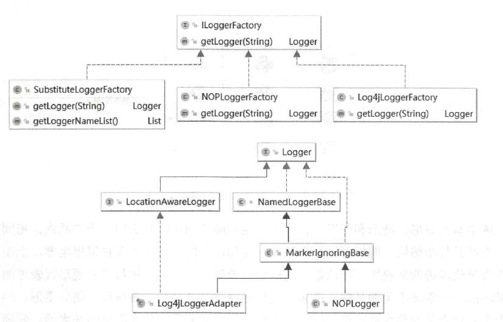
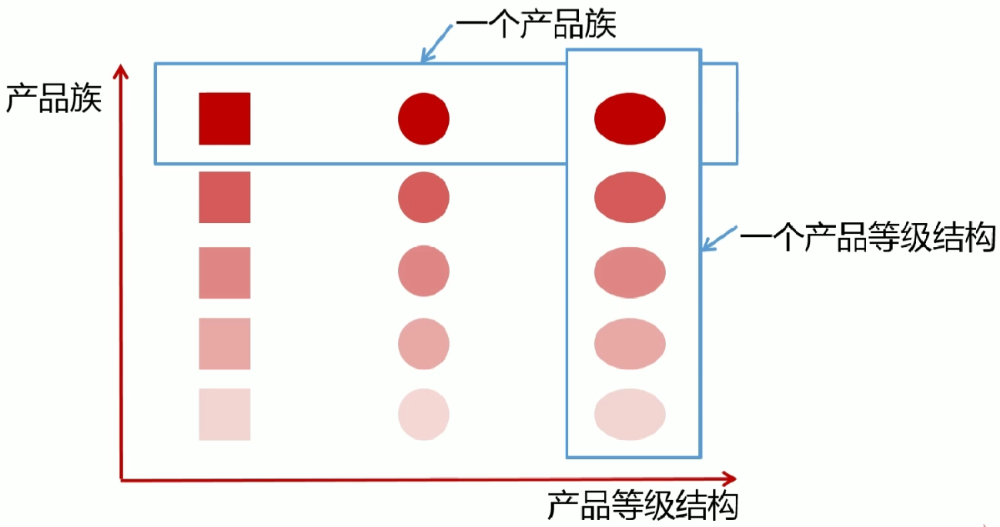

# DesignPattern
从0开始深入理解设计模式的原理及应用

# 1.设计原则

## [1.1.开闭原则](https://github.com/bydjxc/DesignPattern/blob/master/src/main/java/com/jack/design/principle/openclose/%E5%BC%80%E9%97%AD%E5%8E%9F%E5%88%99.md)

## [1.2.依赖倒置原则](https://github.com/bydjxc/DesignPattern/blob/master/src/main/java/com/jack/design/principle/dependenceinversion/%E4%BE%9D%E8%B5%96%E5%80%92%E7%BD%AE%E5%8E%9F%E5%88%99.md)

## [1.3.单一职责原则](https://github.com/bydjxc/DesignPattern/blob/master/src/main/java/com/jack/design/principle/singleresponsibility/%E5%8D%95%E4%B8%80%E8%81%8C%E8%B4%A3.md)

## [1.4.接口隔离原则](https://github.com/bydjxc/DesignPattern/blob/master/src/main/java/com/jack/design/principle/interfacesegregation/%E6%8E%A5%E5%8F%A3%E9%9A%94%E7%A6%BB%E5%8E%9F%E5%88%99.md)

## [1.5.迪米特法则(最少知道原则)](https://github.com/bydjxc/DesignPattern/blob/master/src/main/java/com/jack/design/principle/demeter/%E8%BF%AA%E7%B1%B3%E7%89%B9%E5%8E%9F%E5%88%99.md)

## [1.6.里氏替换原则](https://github.com/bydjxc/DesignPattern/blob/master/src/main/java/com/jack/design/principle/liskovsubstitution/%E9%87%8C%E6%B0%8F%E6%9B%BF%E6%8D%A2%E5%8E%9F%E5%88%99.md)

## [1.7.合成/复用原则(组合/复用原则)](https://github.com/bydjxc/DesignPattern/blob/master/src/main/java/com/jack/design/principle/compositereuse/%E5%90%88%E6%88%90%E5%A4%8D%E7%94%A8%E5%8E%9F%E5%88%99.md)

## 1.8.设计原则总结

​		学习设计原则是学习设计模式的基础。在实际开发过程中， 并不要求所有代码都遵循设计原则，我们要考虑人力、时间、成本、质量，不能刻意追求完美，但要在适当的场景遵循设计原则，这体现的是一种平衡取舍，可以帮助我们设计出更加优雅的代码结构。

# 2.设计模式

​		设计模式是引导读者走出软件设计迷宫的指路明灯，凝聚了软件开发界几十年设计经验的结晶。掌握并使用好设计模式更利于软件开发与设计者设计开发出高可用、高扩展、高可维护性、高健壮性的软件。

## 2.1.工厂模式

### 2.1.1.简单工厂模式

#### 定义：

简单工厂模式( Simple Factory Pattern)是指由一个工厂对象决定创建哪一种产品类的实例,

#### 类型：

创建型，但它不属于GoF的23种设计模式。

#### 适用场景：

简单工厂模式适用于工厂类负责创建的对象较少的场景。

且客户端只需要传入工厂类的参数,就可以创建你需要的对象，对于如何创建对象不需要关心。

#### 缺点：

工厂类的职责相对过重，增加新的产品，需要修改工厂类的判断逻辑，违背了开闭原则。

#### 代码实现：

这里还是以课程为例进行讲解，首先定义一个课程的标准接口ICourse

```java
public interface ICourse {
    /**
     * 课程学习
     * */
    void study();
}
```

创建一个Java 课程的实现JavaCourse 类：

```java
public class JavaCourse implements ICourse{
    @Override
    public void study() {
        System.out.println("学习Java课程");
    }
}
```

创建测试类

```java
public class CourseTest {
    public static void main(String[] args) {
        ICourse course = new JavaCourse();
        course.study();
    }
}
```

​		在上面的代码中，父类ICourse 指向子类JavaCourse 的引用，应用层代码需要依赖JavaCourse,如果业务扩展，继续增加PythonCourse 甚至更多课程，那么客户端的依赖会变得越来越臃肿。因此，我们要想办法把这种依赖减弱，把创建细节隐藏起来。虽然在目前的代码中，创建对象的过程并不复杂，但从代码设计的角度来讲不易于扩展。现在，我们用简单工厂模式对代码进行优化。先增加课程类PythonCourse:

```java
public class PythonCourse implements ICourse{
    @Override
    public void study() {
        System.out.println("学习Python课程");
    }
}
```

创建工厂类CourseFactory :

```java
public class CourseFactory {
    public static ICourse create(String name){
        if ("java".equals(name)){
            return new JavaCourse();
        }else if ("python".equals(name)){
            return new PythonCourse();
        }else {
            return null;
        }
    }
}
```

修改客户端代码：

```java
public class CourseTest {
    public static void main(String[] args) {
        ICourse course = CourseFactory.create("java");
        course.study();
    }
}
```

​		客户端调用变简单了，但如果我们的业务继续扩展，要增加前端课程，那么工厂中的create()方法就要每次都根据产品的增加修改代码逻辑，不符合开闭原则。因此，我们还可以对简单工厂模式继续优化，采用反射技术：

```java
public class CourseFactory {
    public static ICourse create(String name){
        if (!(name == null && "".equals(name))){
            try {
                ICourse course = (ICourse) Class.forName(name).newInstance();
            } catch (Exception e) {
                e.printStackTrace();
            } 
        }
        return null;
    }
}
```

修改客户端调用代码：

```java
public class CourseTest {
    public static void main(String[] args) {
        ICourse course = CourseFactory.create("com.jack.design.pattern.simplefactorypattern.JavaCourse");
        course.study();
    }
}
```

​		优化之后， 产品不断丰富的过程中不需要修改CourseFactory 中的代码。但还有个问题是，方法参数是字符串， 可控性有待提升，而且还需要强制转型。再修改一下代码：

```java
public class CourseFactory {
    public static ICourse create(Class<? extends ICourse> clazz){
        if (clazz != null){
            try {
                ICourse course = clazz.newInstance();
                return course;
            } catch (Exception e) {
                e.printStackTrace();
            }
        }
        return null;
    }
}
```

修改客户端调用代码:

```java
public class CourseTest {
    public static void main(String[] args) {
        ICourse course = CourseFactory.create(JavaCourse.class);
        course.study();
    }
}
```

​		简单工厂模式在JDK 源码中也无处不在，现在我们来举个例子。例如Calendar 类，看一下Calendar.getlnstance()方法， 下面是Calendar 的具体创建类：

```java
private static Calendar createCalendar(TimeZone zone,
                                           Locale aLocale)
    {
        CalendarProvider provider =
            LocaleProviderAdapter.getAdapter(CalendarProvider.class, aLocale)
                                 .getCalendarProvider();
        if (provider != null) {
            try {
                return provider.getInstance(zone, aLocale);
            } catch (IllegalArgumentException iae) {
                // fall back to the default instantiation
            }
        }

        Calendar cal = null;

        if (aLocale.hasExtensions()) {
            String caltype = aLocale.getUnicodeLocaleType("ca");
            if (caltype != null) {
                switch (caltype) {
                case "buddhist":
                cal = new BuddhistCalendar(zone, aLocale);
                    break;
                case "japanese":
                    cal = new JapaneseImperialCalendar(zone, aLocale);
                    break;
                case "gregory":
                    cal = new GregorianCalendar(zone, aLocale);
                    break;
                }
            }
        }
        if (cal == null) {
            // If no known calendar type is explicitly specified,
            // perform the traditional way to create a Calendar:
            // create a BuddhistCalendar for th_TH locale,
            // a JapaneseImperialCalendar for ja_JP_JP locale, or
            // a GregorianCalendar for any other locales.
            // NOTE: The language, country and variant strings are interned.
            if (aLocale.getLanguage() == "th" && aLocale.getCountry() == "TH") {
                cal = new BuddhistCalendar(zone, aLocale);
            } else if (aLocale.getVariant() == "JP" && aLocale.getLanguage() == "ja"
                       && aLocale.getCountry() == "JP") {
                cal = new JapaneseImperialCalendar(zone, aLocale);
            } else {
                cal = new GregorianCalendar(zone, aLocale);
            }
        }
        return cal;
    }
```

还有一个大家经常使用的logback ，我们可以看到LoggerFactory 中有多个重载的方法getLogger():

```java
public static Logger getLogger(String name) {
    ILoggerFactory iLoggerFactory = getILoggerFactory();
    return iLoggerFactory.getLogger(name);
}

public static Logger getLogger(Class clazz) {
    return getLogger(Clazz.getName());
}


```

### 2.1.2.工厂方法模式

#### 定义：

工厂方法模式（ Fatory Method Pattern）是指定义一个创建对象的接口，但让实现这个接口的类来决定实例化哪个类，工厂方法模式让类的实例化推迟到子类中进行。在工厂方法模式中用户只需要关心所需产品对应的工厂，无须关心创建细节，而且加入新的产品时符合开闭原则。

#### 类型：

创建型

#### 适用场景：

创建对象需要大量重复的代码。

客户端不依赖产品实例如何被创建、实现等细节。

一个类通过其子类来指定创建哪个对象。

#### 优点：

用户只需关心创建对象所需的工厂，无需关心创建细节。

加入新产品符合开闭原则，提高扩展性。

#### 缺点：

类的个数容易过多。

增加了系统的抽象性和理解难度。

#### 代码实现：

工厂方法模式主要解决产品扩展的问题。在简单工厂模式中，随着产品链的丰富，如果每个课程的创建逻辑有区别， 则工厂的职责会变得越来越多，有点像万能工厂， 不便于维护。根据单一职责原则我们将职能继续拆分，专人干专事。Java 课程由Java 工厂创建， Python 课程由Python工厂创建，对工厂本身也做一个抽象。来看代码，先创建ICourseFactorγ接口：

```java
public interface ICourseFactory {
    ICourse create();
}
```

再分别创建子工厂， JavaCourseFactory 类的代码如下：

```java
public class JavaCourseFactory implements ICourseFactory {
    @Override
    public ICourse create() {
        return new JavaCourse();
    }
}
```

PythonCourseFactory 类的代码如下：

```java
public class PythonCourseFactory implements ICourseFactory {
    @Override
    public ICourse create() {
        return new PythonCourse();
    }
}
```

测试代码如下：

```java
public class CourseTest {
    public static void main(String[] args) {
        ICourseFactory courseFactory = new JavaCourseFactory();
        ICourse course = courseFactory.create();
        course.study();
    }
}
```

再来看看logback 中工厂方法模式的应用，看看类图就可以了，如下图所示。



工厂方法模式适用于以下场景：
（1）创建对象需要大量重复的代码。
（2）客户端（应用层）不依赖于产品类实例如何被创建、如何被实现等细节。
（3） 一个类通过其子类来指定创建哪个对象。
工厂方法模式也有缺点：
（1）类的个数容易过多，增加复杂度。
（2）增加了系统的抽象性和理解难度。

### 2.1.3.抽象工厂模式

#### 定义：

抽象工厂模式提供一个创建一系列相关就相互依赖对象的接口

无需指定具体的类

#### 类型：

创建型

#### 适用场景：

客户端(应用层)不依赖于产品类实例如何被创建、实现等细节
强调一系列相关的产品对象(属于同一产品族)一起使用创建对象需要大量重复的代码
提供一个产品类的库,所有的产品以同样的接口出现从而使客户端不依赖于具体实现

#### 优点：

具体产品在应用层代码隔离,无须关心创建细节
将一个系列的产品族统一到一起创建

#### 缺点：

规定了所有可能被创建的产品集合,产品族中扩展新的产品困难要修改抽象工厂的接口
增加了系统的抽象性和理解难度

#### 产品等级结构和产品族：



如上图所示

产品族:表示同一个工厂的不同产品，上图中的一个横排就表示了一个产品族

比如说：

第一排，正方形表示美的的空调，圆形表示美的的洗衣机，椭圆表示美的的冰箱

第二排，正方形表示海尔的空调，圆形表示海尔的洗衣机，椭圆表示海尔的冰箱

以此类推

产品等级：表示同一个产品所在的不同的工厂。

比如说：

第一列：第一个正方形表示美的的空调，第二个正方形表示海尔的空调，第三个正方形表示格力的空调

第二列：第一个圆形形表示美的的洗衣机，第二个圆形表示海尔的洗衣机，第三个圆形表示格力的洗衣机

以此类推

#### 代码实现：

在我们进行技能的学习时，不仅仅通过看视频或者看书的方式，同时也要自己总结所学记录笔记。这里我们定义一个课程的工厂接口记录学习的方式，通过视频和记笔记，视频和笔记作为两个学习的方式我们也将其定义成抽象类，添加两个实现类Java和Python分别实现Video和Artica，然后添加对应的工厂类实现课程工厂，在每一个工厂中对获取对应的视频和笔记的学习方法。添加一个测试类，测试我们的程序。

```java
public interface CourseFactory {
    Video getVideo();
    Artical getArtical();
}
```

```java
public abstract class Video {
    public abstract void produce();
}
```

```java
public abstract class Artical {
    public abstract void produce();
}
```

```java
public class JavaVideo extends Video{

    @Override
    public void produce() {
        System.out.println("学习Java课程视频");
    }
}
```

```java
public class PythonVideo extends Video{

    @Override
    public void produce() {
        System.out.println("学习Python课程视频");
    }
}
```

```java
public class JavaCourseFactory implements CourseFactory {
    @Override
    public Video getVideo() {
        return new JavaVideo();
    }

    @Override
    public Artical getArtical() {
        return new JavaArtical();
    }
}
```

```java
public class PythonCourseFactory implements CourseFactory {
    @Override
    public Video getVideo() {
        return new PythonVideo();
    }

    @Override
    public Artical getArtical() {
        return new PythonArtical();
    }
}
```

```java
public class FactoryTest {
    public static void main(String[] args) {
        CourseFactory courseFactory = new JavaCourseFactory();
        Video video = courseFactory.getVideo();
        Artical artical = courseFactory.getArtical();
        video.produce();
        artical.produce();
    }
}
```

​		在上述的代码实现中，Java的学习方法就可以理解为一个产品族，Python也是，视频学习方法Video和笔记Artical则是产品，Java的视频和Python的视频就形成了一个产品等级。当我们需要增加产品族时就非常简单，无需改动任何代码，只需增加对应的实现类就可以了，比如我们新增一个前端的学习课程，那么只需要类似Java和Python一样新建三个类去实现课程工厂Video和Artical就行了。但是，如果需要等价产品等级，那么就会相对较复杂，需要修改所有的类，比如我们学习的最后还要通过源码来进行深入学习，那么就需要新增一个源码的学习实体，然后在我们的工厂中也需要新增这个源码学习方法，同时在已经实现的Java和Python类也需要修改，这是相当麻烦的，所以在使用抽象工厂进行设计时，应尽量将所有涉及到的产品等级都考虑到，防止后期扩展困难。