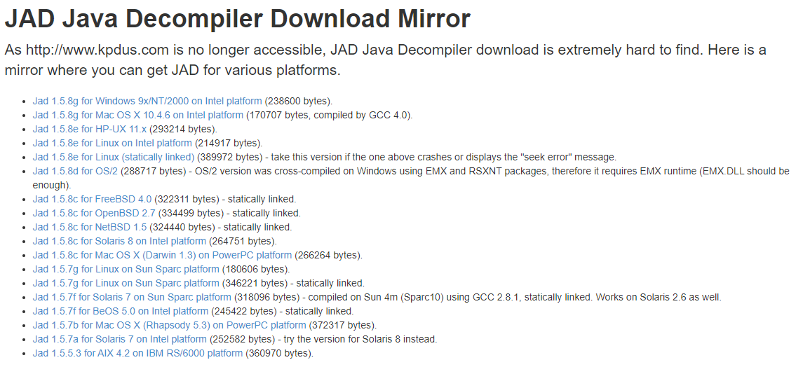

# DesignPattern
从0开始深入理解设计模式的原理及应用

# 1.设计原则

## [1.1.开闭原则](https://github.com/bydjxc/DesignPattern/blob/master/src/main/java/com/jack/design/principle/openclose/%E5%BC%80%E9%97%AD%E5%8E%9F%E5%88%99.md)

## [1.2.依赖倒置原则](https://github.com/bydjxc/DesignPattern/blob/master/src/main/java/com/jack/design/principle/dependenceinversion/%E4%BE%9D%E8%B5%96%E5%80%92%E7%BD%AE%E5%8E%9F%E5%88%99.md)

## [1.3.单一职责原则](https://github.com/bydjxc/DesignPattern/blob/master/src/main/java/com/jack/design/principle/singleresponsibility/%E5%8D%95%E4%B8%80%E8%81%8C%E8%B4%A3.md)

## [1.4.接口隔离原则](https://github.com/bydjxc/DesignPattern/blob/master/src/main/java/com/jack/design/principle/interfacesegregation/%E6%8E%A5%E5%8F%A3%E9%9A%94%E7%A6%BB%E5%8E%9F%E5%88%99.md)

## [1.5.迪米特法则(最少知道原则)](https://github.com/bydjxc/DesignPattern/blob/master/src/main/java/com/jack/design/principle/demeter/%E8%BF%AA%E7%B1%B3%E7%89%B9%E5%8E%9F%E5%88%99.md)

## [1.6.里氏替换原则](https://github.com/bydjxc/DesignPattern/blob/master/src/main/java/com/jack/design/principle/liskovsubstitution/%E9%87%8C%E6%B0%8F%E6%9B%BF%E6%8D%A2%E5%8E%9F%E5%88%99.md)

## [1.7.合成/复用原则(组合/复用原则)](https://github.com/bydjxc/DesignPattern/blob/master/src/main/java/com/jack/design/principle/compositereuse/%E5%90%88%E6%88%90%E5%A4%8D%E7%94%A8%E5%8E%9F%E5%88%99.md)

## 1.8.设计原则总结

​		学习设计原则是学习设计模式的基础。在实际开发过程中， 并不要求所有代码都遵循设计原则，我们要考虑人力、时间、成本、质量，不能刻意追求完美，但要在适当的场景遵循设计原则，这体现的是一种平衡取舍，可以帮助我们设计出更加优雅的代码结构。

# 2.设计模式

​		设计模式是引导读者走出软件设计迷宫的指路明灯，凝聚了软件开发界几十年设计经验的结晶。掌握并使用好设计模式更利于软件开发与设计者设计开发出高可用、高扩展、高可维护性、高健壮性的软件。

## 2.1.工厂模式

### 2.1.1.简单工厂模式

#### 定义：

简单工厂模式( Simple Factory Pattern)是指由一个工厂对象决定创建哪一种产品类的实例,

#### 类型：

创建型，但它不属于GoF的23种设计模式。

#### 适用场景：

简单工厂模式适用于工厂类负责创建的对象较少的场景。

且客户端只需要传入工厂类的参数,就可以创建你需要的对象，对于如何创建对象不需要关心。

#### 缺点：

工厂类的职责相对过重，增加新的产品，需要修改工厂类的判断逻辑，违背了开闭原则。

#### 代码实现：

这里还是以课程为例进行讲解，首先定义一个课程的标准接口ICourse

```java
public interface ICourse {
    /**
     * 课程学习
     * */
    void study();
}
```

创建一个Java 课程的实现JavaCourse 类：

```java
public class JavaCourse implements ICourse{
    @Override
    public void study() {
        System.out.println("学习Java课程");
    }
}
```

创建测试类

```java
public class CourseTest {
    public static void main(String[] args) {
        ICourse course = new JavaCourse();
        course.study();
    }
}
```

​		在上面的代码中，父类ICourse 指向子类JavaCourse 的引用，应用层代码需要依赖JavaCourse,如果业务扩展，继续增加PythonCourse 甚至更多课程，那么客户端的依赖会变得越来越臃肿。因此，我们要想办法把这种依赖减弱，把创建细节隐藏起来。虽然在目前的代码中，创建对象的过程并不复杂，但从代码设计的角度来讲不易于扩展。现在，我们用简单工厂模式对代码进行优化。先增加课程类PythonCourse:

```java
public class PythonCourse implements ICourse{
    @Override
    public void study() {
        System.out.println("学习Python课程");
    }
}
```

创建工厂类CourseFactory :

```java
public class CourseFactory {
    public static ICourse create(String name){
        if ("java".equals(name)){
            return new JavaCourse();
        }else if ("python".equals(name)){
            return new PythonCourse();
        }else {
            return null;
        }
    }
}
```

修改客户端代码：

```java
public class CourseTest {
    public static void main(String[] args) {
        ICourse course = CourseFactory.create("java");
        course.study();
    }
}
```

​		客户端调用变简单了，但如果我们的业务继续扩展，要增加前端课程，那么工厂中的create()方法就要每次都根据产品的增加修改代码逻辑，不符合开闭原则。因此，我们还可以对简单工厂模式继续优化，采用反射技术：

```java
public class CourseFactory {
    public static ICourse create(String name){
        if (!(name == null && "".equals(name))){
            try {
                ICourse course = (ICourse) Class.forName(name).newInstance();
            } catch (Exception e) {
                e.printStackTrace();
            } 
        }
        return null;
    }
}
```

修改客户端调用代码：

```java
public class CourseTest {
    public static void main(String[] args) {
        ICourse course = CourseFactory.create("com.jack.design.pattern.simplefactorypattern.JavaCourse");
        course.study();
    }
}
```

​		优化之后， 产品不断丰富的过程中不需要修改CourseFactory 中的代码。但还有个问题是，方法参数是字符串， 可控性有待提升，而且还需要强制转型。再修改一下代码：

```java
public class CourseFactory {
    public static ICourse create(Class<? extends ICourse> clazz){
        if (clazz != null){
            try {
                ICourse course = clazz.newInstance();
                return course;
            } catch (Exception e) {
                e.printStackTrace();
            }
        }
        return null;
    }
}
```

修改客户端调用代码:

```java
public class CourseTest {
    public static void main(String[] args) {
        ICourse course = CourseFactory.create(JavaCourse.class);
        course.study();
    }
}
```

​		简单工厂模式在JDK 源码中也无处不在，现在我们来举个例子。例如Calendar 类，看一下Calendar.getlnstance()方法， 下面是Calendar 的具体创建类：

```java
private static Calendar createCalendar(TimeZone zone,
                                           Locale aLocale)
    {
        CalendarProvider provider =
            LocaleProviderAdapter.getAdapter(CalendarProvider.class, aLocale)
                                 .getCalendarProvider();
        if (provider != null) {
            try {
                return provider.getInstance(zone, aLocale);
            } catch (IllegalArgumentException iae) {
                // fall back to the default instantiation
            }
        }

        Calendar cal = null;

        if (aLocale.hasExtensions()) {
            String caltype = aLocale.getUnicodeLocaleType("ca");
            if (caltype != null) {
                switch (caltype) {
                case "buddhist":
                cal = new BuddhistCalendar(zone, aLocale);
                    break;
                case "japanese":
                    cal = new JapaneseImperialCalendar(zone, aLocale);
                    break;
                case "gregory":
                    cal = new GregorianCalendar(zone, aLocale);
                    break;
                }
            }
        }
        if (cal == null) {
            // If no known calendar type is explicitly specified,
            // perform the traditional way to create a Calendar:
            // create a BuddhistCalendar for th_TH locale,
            // a JapaneseImperialCalendar for ja_JP_JP locale, or
            // a GregorianCalendar for any other locales.
            // NOTE: The language, country and variant strings are interned.
            if (aLocale.getLanguage() == "th" && aLocale.getCountry() == "TH") {
                cal = new BuddhistCalendar(zone, aLocale);
            } else if (aLocale.getVariant() == "JP" && aLocale.getLanguage() == "ja"
                       && aLocale.getCountry() == "JP") {
                cal = new JapaneseImperialCalendar(zone, aLocale);
            } else {
                cal = new GregorianCalendar(zone, aLocale);
            }
        }
        return cal;
    }
```

还有一个大家经常使用的logback ，我们可以看到LoggerFactory 中有多个重载的方法getLogger():

```java
public static Logger getLogger(String name) {
    ILoggerFactory iLoggerFactory = getILoggerFactory();
    return iLoggerFactory.getLogger(name);
}

public static Logger getLogger(Class clazz) {
    return getLogger(Clazz.getName());
}


```

### 2.1.2.工厂方法模式

#### 定义：

工厂方法模式（ Fatory Method Pattern）是指定义一个创建对象的接口，但让实现这个接口的类来决定实例化哪个类，工厂方法模式让类的实例化推迟到子类中进行。在工厂方法模式中用户只需要关心所需产品对应的工厂，无须关心创建细节，而且加入新的产品时符合开闭原则。

#### 类型：

创建型

#### 适用场景：

创建对象需要大量重复的代码。

客户端不依赖产品实例如何被创建、实现等细节。

一个类通过其子类来指定创建哪个对象。

#### 优点：

用户只需关心创建对象所需的工厂，无需关心创建细节。

加入新产品符合开闭原则，提高扩展性。

#### 缺点：

类的个数容易过多。

增加了系统的抽象性和理解难度。

#### 代码实现：

工厂方法模式主要解决产品扩展的问题。在简单工厂模式中，随着产品链的丰富，如果每个课程的创建逻辑有区别， 则工厂的职责会变得越来越多，有点像万能工厂， 不便于维护。根据单一职责原则我们将职能继续拆分，专人干专事。Java 课程由Java 工厂创建， Python 课程由Python工厂创建，对工厂本身也做一个抽象。来看代码，先创建ICourseFactorγ接口：

```java
public interface ICourseFactory {
    ICourse create();
}
```

再分别创建子工厂， JavaCourseFactory 类的代码如下：

```java
public class JavaCourseFactory implements ICourseFactory {
    @Override
    public ICourse create() {
        return new JavaCourse();
    }
}
```

PythonCourseFactory 类的代码如下：

```java
public class PythonCourseFactory implements ICourseFactory {
    @Override
    public ICourse create() {
        return new PythonCourse();
    }
}
```

测试代码如下：

```java
public class CourseTest {
    public static void main(String[] args) {
        ICourseFactory courseFactory = new JavaCourseFactory();
        ICourse course = courseFactory.create();
        course.study();
    }
}
```

再来看看logback 中工厂方法模式的应用，看看类图就可以了，如下图所示。


工厂方法模式适用于以下场景：
（1）创建对象需要大量重复的代码。
（2）客户端（应用层）不依赖于产品类实例如何被创建、如何被实现等细节。
（3） 一个类通过其子类来指定创建哪个对象。
工厂方法模式也有缺点：
（1）类的个数容易过多，增加复杂度。
（2）增加了系统的抽象性和理解难度。

### 2.1.3.抽象工厂模式

#### 定义：

抽象工厂模式提供一个创建一系列相关又相互依赖对象的接口

无需指定具体的类

#### 类型：

创建型

#### 适用场景：

客户端(应用层)不依赖于产品类实例如何被创建、实现等细节
强调一系列相关的产品对象(属于同一产品族)一起使用创建对象需要大量重复的代码
提供一个产品类的库,所有的产品以同样的接口出现从而使客户端不依赖于具体实现

#### 优点：

具体产品在应用层代码隔离,无须关心创建细节
将一个系列的产品族统一到一起创建

#### 缺点：

规定了所有可能被创建的产品集合,产品族中扩展新的产品困难要修改抽象工厂的接口
增加了系统的抽象性和理解难度

#### 产品等级结构和产品族：


如上图所示

产品族:表示同一个工厂的不同产品，上图中的一个横排就表示了一个产品族

比如说：

第一排，正方形表示美的的空调，圆形表示美的的洗衣机，椭圆表示美的的冰箱

第二排，正方形表示海尔的空调，圆形表示海尔的洗衣机，椭圆表示海尔的冰箱

以此类推

产品等级：表示同一个产品所在的不同的工厂。

比如说：

第一列：第一个正方形表示美的的空调，第二个正方形表示海尔的空调，第三个正方形表示格力的空调

第二列：第一个圆形形表示美的的洗衣机，第二个圆形表示海尔的洗衣机，第三个圆形表示格力的洗衣机

以此类推

#### 代码实现：

在我们进行技能的学习时，不仅仅通过看视频或者看书的方式，同时也要自己总结所学记录笔记。这里我们定义一个课程的工厂接口记录学习的方式，通过视频和记笔记，视频和笔记作为两个学习的方式我们也将其定义成抽象类，添加两个实现类Java和Python分别实现Video和Artica，然后添加对应的工厂类实现课程工厂，在每一个工厂中对获取对应的视频和笔记的学习方法。添加一个测试类，测试我们的程序。

```java
public interface CourseFactory {
    Video getVideo();
    Artical getArtical();
}
```

```java
public abstract class Video {
    public abstract void produce();
}
```

```java
public abstract class Artical {
    public abstract void produce();
}
```

```java
public class JavaVideo extends Video{

    @Override
    public void produce() {
        System.out.println("学习Java课程视频");
    }
}
```

```java
public class PythonVideo extends Video{

    @Override
    public void produce() {
        System.out.println("学习Python课程视频");
    }
}
```

```java
public class JavaCourseFactory implements CourseFactory {
    @Override
    public Video getVideo() {
        return new JavaVideo();
    }

    @Override
    public Artical getArtical() {
        return new JavaArtical();
    }
}
```

```java
public class PythonCourseFactory implements CourseFactory {
    @Override
    public Video getVideo() {
        return new PythonVideo();
    }

    @Override
    public Artical getArtical() {
        return new PythonArtical();
    }
}
```

```java
public class FactoryTest {
    public static void main(String[] args) {
        CourseFactory courseFactory = new JavaCourseFactory();
        Video video = courseFactory.getVideo();
        Artical artical = courseFactory.getArtical();
        video.produce();
        artical.produce();
    }
}
```

​		在上述的代码实现中，Java的学习方法就可以理解为一个产品族，Python也是，视频学习方法Video和笔记Artical则是产品，Java的视频和Python的视频就形成了一个产品等级。当我们需要增加产品族时就非常简单，无需改动任何代码，只需增加对应的实现类就可以了，比如我们新增一个前端的学习课程，那么只需要类似Java和Python一样新建三个类去实现课程工厂Video和Artical就行了。但是，如果需要等价产品等级，那么就会相对较复杂，需要修改所有的类，比如我们学习的最后还要通过源码来进行深入学习，那么就需要新增一个源码的学习实体，然后在我们的工厂中也需要新增这个源码学习方法，同时在已经实现的Java和Python类也需要修改，这是相当麻烦的，所以在使用抽象工厂进行设计时，应尽量将所有涉及到的产品等级都考虑到，防止后期扩展困难。

## 2.2.建造者模式

### 定义：

将一个复杂对象的构建与它的表示分离，使得同样的构建过程可以创建不同的表示

用户只需指定建造者的类型就可以得到它们，建造过程及细节不需要知道

### 类型：

创建型

### 适用场景：

如果一个对象有非常复杂的内部结构(属性)

想把复杂对象的创建和使用分离

### 优点：

封装性好，创建和使用分离

扩展性好，建造类之间独立，一定程度上解耦

### 缺点：

产生多余的builder对象

产品内部发生变化，建造者都要修改，成本较大

### 代码实现：

首先新建一个课程实体类

```java
public class Course {
    /**
     * 课程名字
     * */
    private String courseName;

    /**
     * 课程PPT
     * */
    private String coursePPT;
    
    /**
     * 课程视频
     * */
    private String courseVideo;
    
    /**
     * 课程笔记
     * */
    private String courseArticle;
    
    /**
     * 课程问答
     * */
    private String courseQA;

    public String getCourseName() {
        return courseName;
    }

    public void setCourseName(String courseName) {
        this.courseName = courseName;
    }

    public String getCoursePPT() {
        return coursePPT;
    }

    public void setCoursePPT(String coursePPT) {
        this.coursePPT = coursePPT;
    }

    public String getCourseVideo() {
        return courseVideo;
    }

    public void setCourseVideo(String courseVideo) {
        this.courseVideo = courseVideo;
    }

    public String getCourseArticle() {
        return courseArticle;
    }

    public void setCourseArticle(String courseArticle) {
        this.courseArticle = courseArticle;
    }

    public String getCourseQA() {
        return courseQA;
    }

    public void setCourseQA(String courseQA) {
        this.courseQA = courseQA;
    }

    @Override
    public String toString() {
        return "Course{" +
                "courseName='" + courseName + '\'' +
                ", coursePPT='" + coursePPT + '\'' +
                ", courseVideo='" + courseVideo + '\'' +
                ", courseArticle='" + courseArticle + '\'' +
                ", courseQA='" + courseQA + '\'' +
                '}';
    }
}
```

再新建一个课程构建器的抽象

```java
public abstract class AbstractCourseBuilder {

    public abstract void buildCourseName(String courseName);

    public abstract void  buildCoursePPT(String coursePPT);

    public abstract void  buildCourseVideo(String courseVideo);

    public abstract void  buildCourseArticle(String courseArticle);

    public abstract void  buildCourseQA(String courseQA);

    public abstract Course makeCourse();

}
```

实现一个Java设计模式的构建器实例。

```java
public class CourseBuilder extends AbstractCourseBuilder {

    private Course course = new Course();

    @Override
    public void buildCourseName(String courseName) {
        course.setCourseName(courseName);
    }

    @Override
    public void buildCoursePPT(String coursePPT) {
        course.setCoursePPT(coursePPT);
    }

    @Override
    public void buildCourseVideo(String courseVideo) {
        course.setCourseVideo(courseVideo);
    }

    @Override
    public void buildCourseArticle(String courseArticle) {
        course.setCourseArticle(courseArticle);
    }

    @Override
    public void buildCourseQA(String courseQA) {
        course.setCourseQA(courseQA);
    }

    @Override
    public Course makeCourse() {
        return course;
    }
}

```

课程经理可以构建课程

```Java
public class Coach {

    private AbstractCourseBuilder builder;

    public void setBuilder(AbstractCourseBuilder builder) {
        this.builder = builder;
    }

    public Course makeCourse(String courseName, String coursePPT, String courseVideo, String courseArticle, String courseQA){
        builder.buildCourseName(courseName);
        builder.buildCoursePPT(coursePPT);
        builder.buildCourseVideo(courseVideo);
        builder.buildCourseArticle(courseArticle);
        builder.buildCourseQA(courseQA);

        return builder.makeCourse();
    }
}
```

测试

```java
public class BuilderTest {
    public static void main(String[] args) {
        AbstractCourseBuilder builder = new CourseBuilder();
        Coach coach = new Coach();
        coach.setBuilder(builder);
        Course course = coach.makeCourse("Java设计模式", "Java设计模式PPT", "Java设计模式视频", "Java设计模式笔记", "Java设计模式问答");
        System.out.println(course);
    }
}
```

通过上面的代码可以看出，建造者模式的优点在于能够通过传入不同的参数构建不同的对象，但是如果课程增加属性，那么课程和构建器都需要改变，同时在创建课程的同时也多创建了一个构建者对象。

构建者模式的代码应用在各大开源框架也比较多，而且很多都是通过链式调用的模式来创建对象，下面来讲上述的代码进行改进，使之支持链式调用的模式

```java
public class Course {

    private String courseName;

    private String coursePPT;

    private String courseVideo;

    private String courseArticle;

    private String courseQA;

    public void setCourseName(String courseName) {
        this.courseName = courseName;
    }

    public void setCoursePPT(String coursePPT) {
        this.coursePPT = coursePPT;
    }

    public void setCourseVideo(String courseVideo) {
        this.courseVideo = courseVideo;
    }

    public void setCourseArticle(String courseArticle) {
        this.courseArticle = courseArticle;
    }

    public void setCourseQA(String courseQA) {
        this.courseQA = courseQA;
    }

    public static CourseBuilder builder(){
        return new CourseBuilder();
    }

    @Override
    public String toString() {
        return "Course{" +
                "courseName='" + courseName + '\'' +
                ", coursePPT='" + coursePPT + '\'' +
                ", courseVideo='" + courseVideo + '\'' +
                ", courseArticle='" + courseArticle + '\'' +
                ", courseQA='" + courseQA + '\'' +
                '}';
    }

    public static class CourseBuilder{

        private String courseName;

        private String coursePPT;

        private String courseVideo;

        private String courseArticle;

        private String courseQA;

        public CourseBuilder buildCourseName(String courseName){
            this.courseName = courseName;
            return this;
        }
        public CourseBuilder buildcoursePPT(String coursePPT){
            this.coursePPT = coursePPT;
            return this;
        }
        public CourseBuilder buildCourseVideo(String courseVideo){
            this.courseVideo = courseVideo;
            return this;
        }
        public CourseBuilder buildCourseArticle(String courseArticle){
            this.courseArticle = courseArticle;
            return this;
        }
        public CourseBuilder buildCourseQA(String courseQA){
            this.courseQA = courseQA;
            return this;
        }

        public Course build(){
            Course course = new Course();
            course.setCourseName(this.courseName);
            course.setCoursePPT(coursePPT);
            course.setCourseVideo(courseVideo);
            course.setCourseArticle(courseArticle);
            course.setCourseQA(courseQA);
            return course;
        }

    }
}

```

新建测试类

```java
public class Test {
    public static void main(String[] args) {
        Course course = Course.builder().buildCourseName("Java设计模式").buildcoursePPT("Java设计模式PPT").buildCourseVideo("Java设计模式视频").build();
        System.out.println(course);

    }
}
```

### 源码分析：

在jdk的StringBuilder中也使用了这种模式，通过append()方法返回StringBuilder对象，然后再通过new String()构建一个String字符串。

```java
@Override
public StringBuilder append(String str) {
    super.append(str);
    return this;
}
```

```java
public String toString() {
// Create a copy, don't share the array
return new String(value, 0, count);
}
```

## 2.3.单例模式

### 定义：

保证一个类仅有一个实例，并提供一个全局访问点

### 类型：

创建型

### 适用场景：

想确保任何情况下都绝对只有一个实例

### 优点：

在内存里只有一个实例,减少了内存开销
可以避兔对资源的多重占用
设置全局访问点,严格控制访问

### 缺点：

没有接口，扩展困难

### 重点：

私有构造器

线程安全

延迟加载

序列化和反序列化安全

反射

### 代码实现：

#### 一个简单的懒汉式单例：

```java
public class LazySingleton {

    private static LazySingleton lazySingleton = null;

    private LazySingleton(){}

    public static LazySingleton getInstance(){
        if (lazySingleton == null){
            lazySingleton = new LazySingleton();
        }
        return lazySingleton;
    }
}
```

测试：

```java
public class SingletonTest {
    public static void main(String[] args) {
        LazySingleton lazySingleton  = LazySingleton.getInstance();
        System.out.println("program end");
    }
}
```

上述的代码运行没有问题，但是可能存在线程安全的问题，下面我们新建一个线程测试类。在线程中输出单例对象。

```java
public class TestThread implements Runnable{

    @Override
    public void run() {
        LazySingleton singleton = LazySingleton.getInstance();
        System.out.println(Thread.currentThread().getName() + " " + singleton);
    }
}
```

通过多线程debug的方式来发现这个问题，

```java
public class SingletonTest {
    public static void main(String[] args) {
        Thread thread1 = new Thread(new TestThread());
        Thread thread2 = new Thread(new TestThread());
        thread1.start();
        thread2.start();
        System.out.println("program end");

    }
}
```

首先在main方法里面打上断点，然后设置断点的级别为Thread。


然后再获取单例的判断条件这里打上断点，也设置为Thread级别。


debug运行程序。

在debug窗口的Frams这里，main线程这里有一个下拉选项，打开这个下拉框。


可以看到此时有三个线程处理RUNNING的状态，点击Thread-0就可以切换到这个线程的Debug模式，

此时我们将程序执行一步，也就是执行到if里面去，此时对象还没有被创建，

同样的方式我们切换到Thread-1，然后直接将Thread-1执行完成，

此时控制台就已经输出Thread-1的信息

```markdown
Thread-1 com.jack.design.pattern.creational.singleton.LazySingleton@4d46b4b0
```

我们再次切换到Thread-0，执行完这个线程，可以看到控制台打印了Thread-0的信息。

```markdown
Thread-0 com.jack.design.pattern.creational.singleton.LazySingleton@231d2057
```

通过上述两个输出信息，可以明显的看到创建的不是同一个对象，发生了线程安全问题。

解决方法：对方法进行加锁

#### 线程安全的懒汉式单例：

```java
public synchronized static LazySingleton getInstance(){
    if (lazySingleton == null){
    	lazySingleton = new LazySingleton();
    }
    return lazySingleton;
}
```

由于是对静态的方法进行加锁，所以这里其实是相当于对类进行了加锁，比较消耗资源，影响性能。

#### 双重判定的线程安全懒汉式单例：

```java
public class LazyDoubleCheckSingleton {
    private static LazyDoubleCheckSingleton lazyDoubleCheckSingleton = null;
    private LazyDoubleCheckSingleton(){}

    public static LazyDoubleCheckSingleton getInstance(){
        if (lazyDoubleCheckSingleton == null){
            synchronized (LazyDoubleCheckSingleton.class){
                if (lazyDoubleCheckSingleton == null){
                    //1.分配内存
                    //2.初始化对象
                    //3.设置lazyDoubleCheckSingleton 指向刚分配的内存地址
                    // 2 和 3可能会发生重排序，即顺序颠倒，3在前2在后
                    // intra-thread semantics 规定重排序不会改变单线程内的执行结果，允许单线程内不会改变结果的重排序，提高程序的性能，（重排序的发生是有一定概率的，不一定百分百）
                    lazyDoubleCheckSingleton = new LazyDoubleCheckSingleton();
                }
            }
        }
        return lazyDoubleCheckSingleton;
    }
}
```


Java对象分配的三个过程：

- 1.分配内存
- 2.初始化对象
- 3.设置instance指向刚分配的内存地址

Java的intra-thread semantics机制：

​		规定重排序不会改变单线程内的执行结果，允许单线程内不会改变结果的重排序，提高程序的性能，（重排序的发生是有一定概率的，不一定百分百）

**对上面的代码进行问题分析：**

当线程0获取锁进入程序后，执行完代码lazyDoubleCheckSingleton = new LazyDoubleCheckSingleton();时，这时刚好发生了重排序，而且此时刚刚执行到第三步，如上图所示，线程0的实例指向了刚分配的内存空间，但是此时的instance对象并没有进行初始化；正在这个时候，线程1获取到了锁，并且进入程序进行了判断，显然此时的instance不为空，然后线程1直接返回，但是由于instance并没有完成初始化就被返回了，所以当线程1的程序访问instance对象时，就会抛出异常。

**解决方案：**

1.不允许线程0进行重排序

2.线程0的重排序不让线程1看见

第一种方式：不允许线程0的步骤进行重排序

在对实例对象进行声明时加上volatile

```java
private volatile static LazyDoubleCheckSingleton lazyDoubleCheckSingleton = null;
```

第二种方式：允许线程0重排序，但是让其他线程不可见

首次发生以下五种情况，类就会被立刻初始化：

1.创建A的实例。

2.A类中声明的静态方法被调用。

3.A类中的静态成员被赋值

4.A类中声明的静态成员被使用，并且成员不是常量成员。

5.A类如果是一个顶级类，并且A类中有一个嵌套的断言语句。


代码实现：

```java
public class StaticInnerSingleton {
    private static class InnerClass {
        private static StaticInnerSingleton staticInnerSingleton = new StaticInnerSingleton();
    }
    
    private StaticInnerSingleton(){}

    public static StaticInnerSingleton getInstance(){
        return InnerClass.staticInnerSingleton;
    }
}
```

#### 饿汉式单例：

类初始化就直接创建对象。

```java
public class HungrySingleton {

    private static HungrySingleton hungrySingleton = new HungrySingleton();

    private HungrySingleton(){}

    public static HungrySingleton getInstance(){
        return hungrySingleton;
    }
}
```

#### 序列化破坏单例：

首先让我们的实例类实现Serializable接口，然后在测试类中将这个对象写入文件，再从文件中读取这个对象，最后对两个对象做判断。

```java
public class SingletonTest {
    public static void main(String[] args) throws IOException, ClassNotFoundException {

        HungrySingleton instance = HungrySingleton.getInstance();

        ObjectOutputStream oos = new ObjectOutputStream(new FileOutputStream("singleton-file"));
        oos.writeObject(instance);

        File file = new File("singleton-file");
        ObjectInputStream ois = new ObjectInputStream(new FileInputStream(file));
        HungrySingleton newInstance = (HungrySingleton) ois.readObject();

        System.out.println(instance);
        System.out.println(newInstance);
        System.out.println(instance == newInstance);


    }
}
```

输出结果：

```markdown
com.jack.design.pattern.creational.singleton.HungrySingleton@6d311334
com.jack.design.pattern.creational.singleton.HungrySingleton@5a10411
false
```

通过输出结果可以明显的看出，两个对象不是同一个对象。

我们在单例类中添加一个方法：readResolve

```java
public class HungrySingleton implements Serializable {

    private static HungrySingleton hungrySingleton = new HungrySingleton();

    private HungrySingleton(){}

    public static HungrySingleton getInstance(){
        return hungrySingleton;
    }

    private Object readResolve(){
        return hungrySingleton;
    }
}
```

再次运行测试代码：

```markdown
com.jack.design.pattern.creational.singleton.HungrySingleton@6d311334
com.jack.design.pattern.creational.singleton.HungrySingleton@6d311334
true
```

#### 反射攻击：

```java
public class SingletonTest {
    public static void main(String[] args) throws Exception {

        //反射破坏单例
        HungrySingleton instance = HungrySingleton.getInstance();
        Class clazz = HungrySingleton.class;
        Constructor declaredConstructor = clazz.getDeclaredConstructor();
        declaredConstructor.setAccessible(true);
        HungrySingleton newInstance = (HungrySingleton) declaredConstructor.newInstance();

        System.out.println(instance);
        System.out.println(newInstance);
        System.out.println(instance == newInstance);


    }
}
```

输出结果：

```java
com.jack.design.pattern.creational.singleton.HungrySingleton@776ec8df
com.jack.design.pattern.creational.singleton.HungrySingleton@4eec7777
false
```

可以看到，两个对象不是同一个对象。

如何禁止反射调用呢，很简单，在私有的构造器里面进行判断，如果已经有实例对象了，就抛出异常。

```java
public class HungrySingleton implements Serializable {

    private static HungrySingleton hungrySingleton = new HungrySingleton();

    private HungrySingleton(){
        if (hungrySingleton != null){
            throw new RuntimeException("单例构造器禁止反射调用");
        }
    }

    public static HungrySingleton getInstance(){
        return hungrySingleton;
    }

    private Object readResolve(){
        return hungrySingleton;
    }
}
```

针对静态内部类的单例防止反射也可以类似的进行改造：

```java
public class StaticInnerSingleton {
    private static class InnerClass {
        private static StaticInnerSingleton staticInnerSingleton = new StaticInnerSingleton();
    }

    private StaticInnerSingleton(){
        if (InnerClass.staticInnerSingleton != null){
            throw new RuntimeException("单例构造器禁止反射调用");
        }
    }

    public static StaticInnerSingleton getInstance(){
        return InnerClass.staticInnerSingleton;
    }
}

```

对懒汉式的单例我们来进行一下测试。

同样在私有构造器中加入以下代码。

```java
private LazySingleton(){
    if (lazySingleton != null){
    	throw new RuntimeException("单例构造器禁止反射调用");
    }
}
```

```java
public class SingletonTest {
    public static void main(String[] args) throws Exception {
        LazySingleton instance = LazySingleton.getInstance();
        Class clazz = LazySingleton.class;
        Constructor declaredConstructor = clazz.getDeclaredConstructor();
        declaredConstructor.setAccessible(true);
        LazySingleton newInstance = (LazySingleton) declaredConstructor.newInstance();

        System.out.println(instance);
        System.out.println(newInstance);
        System.out.println(instance == newInstance);


    }
}
```

运行程序，成功抛出异常，接下来，我们将反射创建对象放在上面试试看。

```java
public class SingletonTest {
    public static void main(String[] args) throws Exception {
        LazySingleton instance = LazySingleton.getInstance();
        Class clazz = LazySingleton.class;
        Constructor declaredConstructor = clazz.getDeclaredConstructor();
        declaredConstructor.setAccessible(true);
        LazySingleton newInstance = (LazySingleton) declaredConstructor.newInstance();

        System.out.println(instance);
        System.out.println(newInstance);
        System.out.println(instance == newInstance);


    }
}
```

运行结果：

```markdown
com.jack.design.pattern.creational.singleton.LazySingleton@776ec8df
com.jack.design.pattern.creational.singleton.LazySingleton@4eec7777
false
```

程序正确的创建了两个对象，这种通过反射破坏的单例在懒汉式中是无法避免的。由于多线程的运行跟程序的执行顺序有关，所以在延迟加载的懒汉式中是不可以避免的会被反射攻击。

#### 枚举单例：

新建一个枚举类：

```java
public enum EnumInstance {
    INSTANCE;
    public Object data;

    public Object getData() {
        return data;
    }

    public void setData(Object data) {
        this.data = data;
    }
    public static EnumInstance getInstance(){
        return INSTANCE;
    }
}
```

序列化测试：

```java
public class SingletonTest {
    public static void main(String[] args) throws Exception {

        //枚举单例
        EnumInstance instance = EnumInstance.getInstance();

        ObjectOutputStream oos = new ObjectOutputStream(new FileOutputStream("singleton-file"));
        oos.writeObject(instance);

        File file = new File("singleton-file");
        ObjectInputStream ois = new ObjectInputStream(new FileInputStream(file));
        EnumInstance newInstance = (EnumInstance) ois.readObject();

        System.out.println(instance);
        System.out.println(newInstance);
        System.out.println(instance == newInstance);


    }
}
```

输出结果：

```java
INSTANCE
INSTANCE
true
```

下面我们对里面的data数据进行初始化看看序列化后得到的是不是同一个值：

```java
public class SingletonTest {
    public static void main(String[] args) throws Exception {

        //枚举单例
        EnumInstance instance = EnumInstance.getInstance();
        instance.setData(new Object());

        ObjectOutputStream oos = new ObjectOutputStream(new FileOutputStream("singleton-file"));
        oos.writeObject(instance);

        File file = new File("singleton-file");
        ObjectInputStream ois = new ObjectInputStream(new FileInputStream(file));
        EnumInstance newInstance = (EnumInstance) ois.readObject();

        System.out.println(instance.getData());
        System.out.println(newInstance.getData());
        System.out.println(instance.getData() == newInstance.getData());

    }
}
```

输出结果：

```java
java.lang.Object@2ef1e4fa
java.lang.Object@2ef1e4fa
true
```

再看看是否能够利用反射创建对象：

```java
public class SingletonTest {
    public static void main(String[] args) throws Exception {

        //枚举反射
        EnumInstance instance = EnumInstance.getInstance();
        Class clazz = EnumInstance.class;
        Constructor declaredConstructor = clazz.getDeclaredConstructor(String.class, int.class);
        declaredConstructor.setAccessible(true);
        EnumInstance newInstance = (EnumInstance) declaredConstructor.newInstance("YiFeng", 666);

        System.out.println(instance);
        System.out.println(newInstance);
        System.out.println(instance == newInstance);

    }
}
```

输出结果：

抛出了异常。

使用jad对class文件进行反编译，

官网地址：https://varaneckas.com/jad/



根据自己系统的版本选择对应的版本进行下载，然后解压下载后的文件。


将jad所在的目录加入到环境变量中，方便以后进行反编译。

最后进入到EnumInstance.class的目录，运行命令进行反编译

jad   EnumInstance.class

之后会生成一个EnumInstance.jad的文件

利用jad对EnumInstance这个class进行反编译，对生成的jad文件打开查看：

```java
public final class EnumInstance extends Enum
{

    public static EnumInstance[] values()
    {
        return (EnumInstance[])$VALUES.clone();
    }

    public static EnumInstance valueOf(String name)
    {
        return (EnumInstance)Enum.valueOf(com/jack/design/pattern/creational/singleton/EnumInstance, name);
    }

    private EnumInstance(String s, int i)
    {
        super(s, i);
    }

    public Object getData()
    {
        return data;
    }

    public void setData(Object data)
    {
        this.data = data;
    }

    public static EnumInstance getInstance()
    {
        return INSTANCE;
    }

    public static final EnumInstance INSTANCE;
    public Object data;
    private static final EnumInstance $VALUES[];

    static 
    {
        INSTANCE = new EnumInstance("INSTANCE", 0);
        $VALUES = (new EnumInstance[] {
            INSTANCE
        });
    }
}
```

​		可以看到，枚举类自动生成了一个私有的构造器private EnumInstance(String s, int i)，然后在静态代码块中对INSTANCE进行了初始化，所以枚举类是一个天然的单例类，同时在反射中也不允许通过构造器来创建对象，所以保证了不被反射攻击。

向枚举类中添加方法：

```java
public enum EnumInstance {
    INSTANCE{
        @Override
        protected void printTest(){
            System.out.println("print test");
        }
    };
    public Object data;

    protected abstract void printTest();

    public Object getData() {
        return data;
    }

    public void setData(Object data) {
        this.data = data;
    }
    public static EnumInstance getInstance(){
        return INSTANCE;
    }
}
```

对这个class文件进行反编译

```java
public abstract class EnumInstance extends Enum
{

    public static EnumInstance[] values()
    {
        return (EnumInstance[])$VALUES.clone();
    }

    public static EnumInstance valueOf(String name)
    {
        return (EnumInstance)Enum.valueOf(com/jack/design/pattern/creational/singleton/EnumInstance, name);
    }

    private EnumInstance(String s, int i)
    {
        super(s, i);
    }

    protected abstract void printTest();

    public Object getData()
    {
        return data;
    }

    public void setData(Object data)
    {
        this.data = data;
    }

    public static EnumInstance getInstance()
    {
        return INSTANCE;
    }


    public static final EnumInstance INSTANCE;
    public Object data;
    private static final EnumInstance $VALUES[];

    static 
    {
        INSTANCE = new EnumInstance("INSTANCE", 0) {

            protected void printTest()
            {
                System.out.println("print test");
            }

        }
;
        $VALUES = (new EnumInstance[] {
            INSTANCE
        });
    }
}
```

它是在静态代码块里面使用匿名内部类的方式来重写这个方法的。

jad这个反编译工具非常好用，希望大家在日常工作中也可以利用起来。

#### 基于容器的单例模式：

```java
public class ContainerSingleton {
    private static Map<String, Object> singletonMap = new HashMap<>();

    private ContainerSingleton(){}

    private static void putInstance(String key, Object instance){
        if ((!StringUtils.isEmpty(key)) && instance != null){
            singletonMap.put(key, instance);
        }
    }

    public static Object getInstance(String key){
        return singletonMap.get(key);
    }

}
```

在线程中加入容器代码：

```java
public class TestThread implements Runnable{

    @Override
    public void run() {
        ContainerSingleton.putInstance("object", new Object());
        Object object = ContainerSingleton.getInstance("object");
        System.out.println(Thread.currentThread().getName() + " " + object);

    }
}
```

然后测试：

```
public class SingletonTest {
    public static void main(String[] args) throws Exception {
        LazySingleton lazySingleton  = LazySingleton.getInstance();
        System.out.println("program end");
        Thread thread1 = new Thread(new TestThread());
        Thread thread2 = new Thread(new TestThread());
        thread1.start();
        thread2.start();
        System.out.println("program end");
    }
}
```

​		通过debug的方式运行程序会发现，该设计会引发线程安全，所以可以用安全的Map，如ConcurrentHashMap等。

基于ThreadLocal实现的伪单例模式（基于线程的单例）：

```java
public class ThreadLocalInstance {
    private static final ThreadLocal<ThreadLocalInstance> threadLocal = new ThreadLocal(){
        @Override
        protected Object initialValue() {
            return new ThreadLocalInstance();
        }
    };

    private ThreadLocalInstance(){}

    private static ThreadLocalInstance getInstance(){
        return threadLocal.get();
    }

}
```

在线程中调用：

```java
public class TestThread implements Runnable{

    @Override
    public void run() {

        ThreadLocalInstance instance = ThreadLocalInstance.getInstance();
        System.out.println(Thread.currentThread().getName() + " " + instance);

    }
}
```

```java
public class SingletonTest {
    public static void main(String[] args) throws Exception {
        LazySingleton lazySingleton  = LazySingleton.getInstance();
        Thread thread1 = new Thread(new TestThread());
        Thread thread2 = new Thread(new TestThread());
        thread1.start();
        thread2.start();
    }
}
```

直接运行查看结果：

```markdown
Thread-0 com.jack.design.pattern.creational.singleton.ThreadLocalInstance@6299d4f3
Thread-1 com.jack.design.pattern.creational.singleton.ThreadLocalInstance@7f5b7c1b
```

可以看到，两个线程输出的结果是不一样的。

我们在主线程中调用一下这个ThreadLocal。

```java
public class SingletonTest {
    public static void main(String[] args) throws Exception {
        LazySingleton lazySingleton  = LazySingleton.getInstance();
        Thread thread1 = new Thread(new TestThread());
        Thread thread2 = new Thread(new TestThread());
        thread1.start();
        thread2.start();
        System.out.println(ThreadLocalInstance.getInstance());
        System.out.println(ThreadLocalInstance.getInstance());
        System.out.println(ThreadLocalInstance.getInstance());
        System.out.println(ThreadLocalInstance.getInstance());
        System.out.println(ThreadLocalInstance.getInstance());
    }
}
```

运行代码：

```markdown
com.jack.design.pattern.creational.singleton.ThreadLocalInstance@776ec8df
com.jack.design.pattern.creational.singleton.ThreadLocalInstance@776ec8df
com.jack.design.pattern.creational.singleton.ThreadLocalInstance@776ec8df
com.jack.design.pattern.creational.singleton.ThreadLocalInstance@776ec8df
com.jack.design.pattern.creational.singleton.ThreadLocalInstance@776ec8df
Thread-0 com.jack.design.pattern.creational.singleton.ThreadLocalInstance@71d9ab02
Thread-1 com.jack.design.pattern.creational.singleton.ThreadLocalInstance@701e866
```

可以看到，在主线程中每次输出的都是同一个对象，由此我们可以知道，通过ThreadLocal拿到的对象是线程私有的，每一个线程共享一个对象。

那么ThreadLocal是怎么做到线程隔离的呢。打开ThreadLocal的源码

set方法：

```java
public void set(T value) {
    Thread t = Thread.currentThread();
    ThreadLocalMap map = getMap(t);
    if (map != null)
        map.set(this, value);
    else
        createMap(t, value);
}
```

ThreadLocalMap是它的一个静态内部类，首先它会获取当前线程，然后通过getMap方法拿到当前线程的ThreadLocalMap对象，如果为空则表示是第一次进入这个线程则会创建一个新的ThreadLocalMap，将T加入map，否则就会在当前的ThreadLocalMap中加入T实例。

getMap和createMap方法源码如下所示:

```java
ThreadLocalMap getMap(Thread t) {
    return t.threadLocals;
}
```

```java
void createMap(Thread t, T firstValue) {
	t.threadLocals = new ThreadLocalMap(this, firstValue);
}
```


### 源码分析：

JDK中的java.lang.Rumtime就运用了饿汉式的单例模式：

```java
public class Runtime {
    private static Runtime currentRuntime = new Runtime();

    /**
     * Returns the runtime object associated with the current Java application.
     * Most of the methods of class <code>Runtime</code> are instance
     * methods and must be invoked with respect to the current runtime object.
     *
     * @return  the <code>Runtime</code> object associated with the current
     *          Java application.
     */
    public static Runtime getRuntime() {
        return currentRuntime;
    }

    /** Don't let anyone else instantiate this class */
    private Runtime() {}
}

```

mybatis中的ErrorContext使用了ThreadLocal来实现，使每一个线程获取的都是一个单独的Context

```java
public class ErrorContext {
    private static final String LINE_SEPARATOR = System.getProperty("line.separator", "\n");
    private static final ThreadLocal<ErrorContext> LOCAL = new ThreadLocal();
    private ErrorContext stored;
    private String resource;
    private String activity;
    private String object;
    private String message;
    private String sql;
    private Throwable cause;

    private ErrorContext() {
    }

    public static ErrorContext instance() {
        ErrorContext context = (ErrorContext)LOCAL.get();
        if (context == null) {
            context = new ErrorContext();
            LOCAL.set(context);
        }

        return context;
    }
}
```

## 2.4.原型模式

### 定义：

原型实例指定创建对象的种类，并且通过拷贝这些对象创建新的对象。

不需要知道任何的创建细节，不调用构造函数

### 类型：

创建型

### 适用场景：

类初始化消耗太多资源

new产生的一个对象需要非常繁琐的过程(数据准备、访问权限等)

构造函数比较复杂

循环体中生成大量对象时

### 优点：

原型模式性能比直接newー个对象性能高

简化创建过程

### 缺点：

必须配备克隆方法

对克隆复杂对象或对克隆出的对象进行复杂改造时,容易引入风险

深拷贝、滤拷贝要运用得当

### 扩展：

深克隆

浅克隆

### 代码实现：

新建一个邮件的类

```java
public class Mail {
    private String name;
    private String email;
    private String content;

    public Mail(){
        System.out.println("Mail class Constructor");
    }

    public String getName() {
        return name;
    }

    public void setName(String name) {
        this.name = name;
    }

    public String getEmail() {
        return email;
    }

    public void setEmail(String email) {
        this.email = email;
    }

    public String getContent() {
        return content;
    }

    public void setContent(String content) {
        this.content = content;
    }

    @Override
    public String toString() {
        return "Mail{" +
                "name='" + name + '\'' +
                ", email='" + email + '\'' +
                ", content='" + content + '\'' +
                '}';
    }
}
```

再新建一个邮箱工具类进行邮件的发送，其中也有一个默认的模板邮件

```java
public class MailUtil {
    public static void sendMail(Mail mail){
        String s = "向{0}同学发送邮件,邮件地址：{1},邮件内容：{2}发送邮件成功";
        System.out.println(MessageFormat.format(s, mail.getName(), mail.getEmail(), mail.getContent()));
    }

    public static void saveOriginalMailRecord(Mail mail){
        System.out.println("存储originalMail目录，originalMail为" + mail.getContent());
    }
}
```

添加测试类：

```java
public class MailTest {
    public static void main(String[] args) {
        Mail mail = new Mail();
        mail.setContent("初始化模板");
        for (int i = 0; i < 10; i++) {
            mail.setName("姓名" + i);
            mail.setEmail("姓名" + i + "@qq.com");
            mail.setContent("测试内容");
            MailUtil.sendMail(mail);
        }
        MailUtil.saveOriginalMailRecord(mail);
    }
}
```

运行结果：


邮箱的原始内容被改变了，这明显不是我们希望看到的。

解决方法1：

将存储原始文件的内容代码移动到前面。

解决方法2：

在循环中新建一个Mail对象进行邮件发送

解决办法3：

在循环中新建一个对象来克隆这个原始对象。

让Mail实现Cloneable接口，然后再测试类中使用克隆。

```
@Override
    protected Object clone() throws CloneNotSupportedException {
        System.out.println("clone mail object");
        return super.clone();
    }
```

```java
public class MailTest {
    public static void main(String[] args) throws CloneNotSupportedException {
        Mail mail = new Mail();
        mail.setContent("初始化模板");
        for (int i = 0; i < 10; i++) {
            Mail mailTemp = (Mail) mail.clone();
            mailTemp.setName("姓名" + i);
            mailTemp.setEmail("姓名" + i + "@qq.com");
            mailTemp.setContent("测试内容");
            MailUtil.sendMail(mailTemp);
        }
        MailUtil.saveOriginalMailRecord(mail);
    }
}
```


程序正常输出

浅克隆与深克隆：

新建一个Pig类并且实现Cloneable接口重写clone方法。

```java
public class Pig implements Cloneable{
    private String name;
    private Date birthday;

    public String getName() {
        return name;
    }

    public void setName(String name) {
        this.name = name;
    }

    public Date getBirthday() {
        return birthday;
    }

    public void setBirthday(Date birthday) {
        this.birthday = birthday;
    }

    public Pig(String name, Date birthday) {
        this.name = name;
        this.birthday = birthday;
    }

    @Override
    protected Object clone() throws CloneNotSupportedException {
        return super.clone();
    }

    @Override
    public String toString() {
        return "Pig{" +
                "name='" + name + '\'' +
                ", birthday=" + birthday +
                '}'+super.toString();
    }
}
```

对这个类进行测试：

```
public class CloneTest {
    public static void main(String[] args) throws CloneNotSupportedException {
        Date birthday = new Date(0L);
        Pig pig1 = new Pig("佩奇", birthday);
        Pig pig2 = (Pig) pig1.clone();
        System.out.println(pig1);
        System.out.println(pig2);

        pig1.getBirthday().setTime(6666666666666L);
        pig1.setName("猪猪侠");
        System.out.println(pig1);
        System.out.println(pig2);

        pig2.getBirthday().setTime(555555555555L);
        System.out.println(pig1);
        System.out.println(pig2);
    }
}
```

```markdown
Pig{name='佩奇', birthday=Thu Jan 01 08:00:00 CST 1970}com.jack.design.pattern.creational.prototype.clone.Pig@404b9385
Pig{name='佩奇', birthday=Thu Jan 01 08:00:00 CST 1970}com.jack.design.pattern.creational.prototype.clone.Pig@6d311334
Pig{name='猪猪侠', birthday=Wed Apr 04 19:51:06 CST 2181}com.jack.design.pattern.creational.prototype.clone.Pig@404b9385
Pig{name='佩奇', birthday=Wed Apr 04 19:51:06 CST 2181}com.jack.design.pattern.creational.prototype.clone.Pig@6d311334
Pig{name='猪猪侠', birthday=Mon Aug 10 09:59:15 CDT 1987}com.jack.design.pattern.creational.prototype.clone.Pig@404b9385
Pig{name='佩奇', birthday=Mon Aug 10 09:59:15 CDT 1987}com.jack.design.pattern.creational.prototype.clone.Pig@6d311334
```

​		可以看到，只是对String类型的变量进行改变不会影响到其他对象，但是如果对引用类型的变量进行改变则会引起其他对象的改变。这种只实现了基本类型的的拷贝的克隆就叫做浅克隆。但是在实际的开发中，我们需要对引用类型的变量也能够克隆，这是我们就必须要利用深克隆。

深克隆：对克隆对象内部的引用类型也进行克隆。

在pig的clone方法中对birthday也进行一次克隆。

```java
@Override
    protected Object clone() throws CloneNotSupportedException {
        Pig pig = (Pig) super.clone();
        //深克隆
        pig.birthday = ((Date) pig.birthday.clone());
        return pig;
    }
```

再次运行测试方法：

```java
Pig{name='佩奇', birthday=Thu Jan 01 08:00:00 CST 1970}com.jack.design.pattern.creational.prototype.clone.Pig@404b9385
Pig{name='佩奇', birthday=Thu Jan 01 08:00:00 CST 1970}com.jack.design.pattern.creational.prototype.clone.Pig@6d311334
Pig{name='猪猪侠', birthday=Wed Apr 04 19:51:06 CST 2181}com.jack.design.pattern.creational.prototype.clone.Pig@404b9385
Pig{name='佩奇', birthday=Thu Jan 01 08:00:00 CST 1970}com.jack.design.pattern.creational.prototype.clone.Pig@6d311334
Pig{name='猪猪侠', birthday=Wed Apr 04 19:51:06 CST 2181}com.jack.design.pattern.creational.prototype.clone.Pig@404b9385
Pig{name='佩奇', birthday=Mon Aug 10 09:59:15 CDT 1987}com.jack.design.pattern.creational.prototype.clone.Pig@6d311334
```

可以看到，不管是对pig1还是pig2的birthday进行修改都不会影响其他对象的birthday。
基于对象流的方式实现深克隆，对象需要实现序列化接口。

```java
public class CloneTest {
    public static void main(String[] args) throws Exception {
        //使用对象流实现深克隆
        Date birthday = new Date(0L);
        Pig pig1 = new Pig("佩奇", birthday);
        //写进流
        ByteArrayOutputStream byteArrayOutputStream = new ByteArrayOutputStream();
        ObjectOutputStream objectOutputStream = new ObjectOutputStream(byteArrayOutputStream);
        objectOutputStream.writeObject(pig1);

        //读取流
        ByteArrayInputStream byteArrayInputStream=new ByteArrayInputStream(byteArrayOutputStream.toByteArray());
        ObjectInputStream objectInputStream=new ObjectInputStream(byteArrayInputStream);
        Pig pig2 = (Pig) objectInputStream.readObject();
        pig2.getBirthday().setTime(77777777777L);
        System.out.println(pig1);
        System.out.println(pig2);


    }
}
```

输出结果：

```markdown
Pig{name='佩奇', birthday=Thu Jan 01 08:00:00 CST 1970}com.jack.design.pattern.creational.prototype.clone.Pig@448139f0
Pig{name='佩奇', birthday=Mon Jun 19 12:56:17 CST 1972}com.jack.design.pattern.creational.prototype.clone.Pig@69d0a921
```

克隆破坏单例：

这里以饿汉式的单例为例，让它实现Cloneable接口重写clone方法，然后对其进行测试。

```java
public class HungrySingleton implements Serializable, Cloneable {

    private static HungrySingleton hungrySingleton = new HungrySingleton();

    private HungrySingleton(){
        if (hungrySingleton != null){
            throw new RuntimeException("单例构造器禁止反射调用");
        }
    }

    public static HungrySingleton getInstance(){
        return hungrySingleton;
    }

    private Object readResolve(){
        return hungrySingleton;
    }

    @Override
    protected Object clone() throws CloneNotSupportedException {
        return super.clone();
    }
}
```

```java
public class CloneTest {
    public static void main(String[] args) throws CloneNotSupportedException, NoSuchMethodException, InvocationTargetException, IllegalAccessException {

        HungrySingleton hungrySingleton = HungrySingleton.getInstance();
        Method method = hungrySingleton.getClass().getDeclaredMethod("clone");
        method.setAccessible(true);
        HungrySingleton cloneHungrySingleton = (HungrySingleton) method.invoke(hungrySingleton);
        System.out.println(hungrySingleton);
        System.out.println(cloneHungrySingleton);


    }
}
```

运行结果如下：

```markdown
com.jack.design.pattern.creational.singleton.HungrySingleton@4eec7777
com.jack.design.pattern.creational.singleton.HungrySingleton@3b07d329
```

那么如何防止克隆破坏单例模式呢：

1.不实现克隆接口。

2.重写克隆方法，并返回这个实例。

```java
@Override
protected Object clone() throws CloneNotSupportedException {
    return getInstance();
}
```


### 源码分析：

jdk中很多的类都实现了Cloneable接口重写了clone

ArrayList：

```java
public Object clone() {
        try {
            ArrayList<?> v = (ArrayList<?>) super.clone();
            v.elementData = Arrays.copyOf(elementData, size);
            v.modCount = 0;
            return v;
        } catch (CloneNotSupportedException e) {
            // this shouldn't happen, since we are Cloneable
            throw new InternalError(e);
        }
    }
```

HashMap：

```java
@Override
public Object clone() {
    HashMap<K,V> result;
    try {
        result = (HashMap<K,V>)super.clone();
    } catch (CloneNotSupportedException e) {
        // this shouldn't happen, since we are Cloneable
        throw new InternalError(e);
    }
    result.reinitialize();
    result.putMapEntries(this, false);
    return result;
}
```

## 2.5.外观模式

### 定义：

又叫门面模式,提供了一个统一的接口,用来访向子系统中的一群接口。

外观模式定义了ー个高层接口,让子系统更容易使用。

### 类型：

结构型

### 适用场景：

子系统越来越复杂,增加外观模式提供简单调用接口
构建多层系统结构,利用外观对象作为每层的入口,简化层间调用

### 优点：

简化了调用过程,无需了解深入子系统,防止带来风险。

减少系统依赖、松散耦合。

更好的划分访问层次。

符合迪米特法则,即最少知道原则。

### 缺点：

增加子系统、扩展子系统行为容易引入风险。

不符合开闭原则。

### 代码实现：

场景：

积分兑换礼物

涉及到的业务：资格校验，积分支付校验，积分字符，物流系统对接。

积分礼物实体类：

```java
public class PointsGift {
    private String name;

    public PointsGift(String name) {
        this.name = name;
    }

    public String getName() {
        return name;
    }
}
```

资格校验：

```java
public class QualifyService {
    public boolean isAvailable(PointsGift gift){
        System.out.println("校验" + gift.getName() + " 积分资格通过，库存通过");
        return true;
    }
}
```

支付校验：

```java
public class PointsPaymentService {
    public boolean pay(PointsGift gift){
        //扣减积分
        System.out.println("支付" + gift.getName() + "积分成功");
        return true;
    }
}
```

物流对接：

```java
public class ShippingService {
    public String shipGift(PointsGift gift){
        //对接物流
        System.out.println(gift.getName() + "进入物流系统");
        String shippingOrderNO = "666666";
        return shippingOrderNO;
    }
}
```

积分兑换：

```java
public class GiftExchangeService {
    private QualifyService qualifyService = new QualifyService();
    private PointsPaymentService pointsPaymentService = new PointsPaymentService();
    private ShippingService shippingService = new ShippingService();
    
    public void giftExchange(PointsGift gift){
        if (qualifyService.isAvailable(gift)){
            //资格校验通过
            if (pointsPaymentService.pay(gift)){
                //支付校验通过
                String shippingOrderNO = shippingService.shipGift(gift);
                System.out.println("物流系统下单成功，订单号是：" + shippingOrderNO);
            }
        }
    }
}
```

测试：

```java
public class FacadeTest {
    public static void main(String[] args) {
        PointsGift gift = new PointsGift("机械键盘");
        GiftExchangeService exchangeService = new GiftExchangeService();
        exchangeService.giftExchange(gift);
    }
}
```

输出结果：

```markdown
校验机械键盘 积分资格通过，库存通过
支付机械键盘积分成功
机械键盘进入物流系统
物流系统下单成功，订单号是：666666
```

GiftExchangeService是一个实体外观类的设计，在实际的业务模型中，如果这些子系统可能会有增加的话，扩展就不是很方便，要修改这个外观类，不符合开闭原则，所以可以写一个外观接口，然后如果有新的子系统加入的话就再写一个新的实现类，不用去改变原先的逻辑。

### 源码分析：

springjdbc的JDBCUtils

mybatis中的Configuration

Tomcat中的RequestFacade，ResponseFacade等等

## 2.6.装饰者模式

### 定义：

在不改变原先对象功能的基础上，将功能附加到对象上

提供了比继承更有弹性的替代方案（扩展原有对象功能）

### 类型：

结构型

### 适用场景：

扩展一个类的功能或给一个类添加附加职责

动态得给一个对象添加功能，这个功能还可以再动态地撤销

### 优点：

继承的有力补充,比继承灵活,不改变原有对象的情况下给一个对象扩展功能

通过使用不同装饰类以及这些装饰类的排列组合,可以实现不同效果

符合开闭原则

### 缺点：

会出现更多的代码,更多的类,增加程序复杂性

动态装饰时,多层装饰时会更复杂

### 代码实现：

场景：煎饼果子

普通的煎饼果子，售价8元

加一个鸡蛋的煎饼果子售价多一元

加一个鸡蛋并且加一根香肠售价比只加鸡蛋多两元

```java
public class BatterCake {
    public String getDesc(){
        return "煎饼";
    }
    public int cost(){
        return 8;
    }
}
```

```java
public class BatterCakeWithEgg extends BatterCake{

    @Override
    public String getDesc(){
        return super.getDesc() + "加一个鸡蛋";
    }
    @Override
    public int cost(){
        return super.cost() + 1;
    }
}

```

```java
public class BatterCakeWithEggSausage extends BatterCakeWithEgg{

    @Override
    public String getDesc(){
        return super.getDesc() + "加一根香肠";
    }
    @Override
    public int cost(){
        return super.cost() + 2;
    }
}
```

测试：

```java
public class Test {
    public static void main(String[] args) {
        BatterCake batterCake = new BatterCake();
        System.out.println(batterCake.getDesc() + "销售价格：" + batterCake.cost());

        BatterCakeWithEgg batterCakeWithEgg = new BatterCakeWithEgg();
        System.out.println(batterCakeWithEgg.getDesc() + "销售价格：" + batterCakeWithEgg.cost());

        BatterCakeWithEggSausage batterCakeWithEggSausage = new BatterCakeWithEggSausage();
        System.out.println(batterCakeWithEggSausage.getDesc() + "销售价格：" + batterCakeWithEggSausage.cost());
    }
}
```

输出：

```
煎饼销售价格：8
煎饼加一个鸡蛋销售价格：9
煎饼加一个鸡蛋加一根香肠销售价格：11
```

现在有一个用户需要加两个鸡蛋，两根香肠，由于系统中并没有设计这样的方法所以就无法卖，这样对老板来说是非常亏的，不能根据用户的需求灵活的配置煎饼。

下面使用装饰者模式来改造这个场景。

首先建立一个抽象煎饼类：

```java
public abstract class AbstractBatterCake {
    public abstract String getDesc();
    public abstract int cost();
}
```

让我们的煎饼来继承它：

```java
public class BatterCake extends AbstractBatterCake{
    @Override
    public String getDesc(){
        return "煎饼";
    }
    @Override
    public int cost(){
        return 8;
    }
}
```

建立一个抽象装饰器也来继承这个抽象煎饼，并且将这个抽象类作为参数传入构造器中，重写两个方法，并且将返回值改成传入的抽象煎饼的方法。

```java
public class AbstractDecorator extends AbstractBatterCake {

    private AbstractBatterCake abstractBatterCake;

    public AbstractDecorator(AbstractBatterCake abstractBatterCake){
        this.abstractBatterCake = abstractBatterCake;
    }
    @Override
    public String getDesc() {
        return this.abstractBatterCake.getDesc();
    }

    @Override
    public int cost() {
        return this.abstractBatterCake.cost();
    }
}
```

编写具体的装饰器鸡蛋装饰者继承抽象装饰器：

```java
public class EggDecorator extends AbstractDecorator {

    public EggDecorator(AbstractBatterCake abstractBatterCake) {
        super(abstractBatterCake);
    }

    @Override
    public String getDesc() {
        return super.getDesc() + "加一个鸡蛋";
    }

    @Override
    public int cost() {
        return super.cost() + 1;
    }
}
```

编写具体的装饰器香肠装饰者继承抽象装饰器：

```java
public class SausageDecorator extends AbstractDecorator{
    public SausageDecorator(AbstractBatterCake abstractBatterCake) {
        super(abstractBatterCake);
    }

    @Override
    public String getDesc() {
        return super.getDesc() + "加一根香肠";
    }

    @Override
    public int cost() {
        return super.cost() + 2;
    }
}
```

测试，在这里我们就可以自由地进行组合，通过传入不通的抽象实体。

```java
public class Test {
    public static void main(String[] args) {
        AbstractBatterCake abstractBatterCake;

        abstractBatterCake = new BatterCake();

        //加一个鸡蛋
        abstractBatterCake = new EggDecorator(abstractBatterCake);
        //加一个鸡蛋
        abstractBatterCake = new EggDecorator(abstractBatterCake);
        //加一根香肠
        abstractBatterCake = new SausageDecorator(abstractBatterCake);
        //加一根香肠
        abstractBatterCake = new SausageDecorator(abstractBatterCake);

        System.out.println(abstractBatterCake.getDesc() + "销售价格：" + abstractBatterCake.cost());

    }
}
```

输出结果：

煎饼加一个鸡蛋加一个鸡蛋加一根香肠加一根香肠销售价格：14

### 源码分析：

BufferedReader：

BufferedReader继承了抽象类Reader，然后将Reader作为成员变量，通过一个构造方法将Reader传入进去，

```java
public class BufferedReader extends Reader {

    private Reader in;

    private char cb[];
    private int nChars, nextChar;

    private static final int INVALIDATED = -2;
    private static final int UNMARKED = -1;
    private int markedChar = UNMARKED;
    private int readAheadLimit = 0; /* Valid only when markedChar > 0 */

    /** If the next character is a line feed, skip it */
    private boolean skipLF = false;

    /** The skipLF flag when the mark was set */
    private boolean markedSkipLF = false;

    private static int defaultCharBufferSize = 8192;
    private static int defaultExpectedLineLength = 80;

    /**
     * Creates a buffering character-input stream that uses an input buffer of
     * the specified size.
     *
     * @param  in   A Reader
     * @param  sz   Input-buffer size
     *
     * @exception  IllegalArgumentException  If {@code sz <= 0}
     */
    public BufferedReader(Reader in, int sz) {
        super(in);
        if (sz <= 0)
            throw new IllegalArgumentException("Buffer size <= 0");
        this.in = in;
        cb = new char[sz];
        nextChar = nChars = 0;
    }

    /**
     * Creates a buffering character-input stream that uses a default-sized
     * input buffer.
     *
     * @param  in   A Reader
     */
    public BufferedReader(Reader in) {
        this(in, defaultCharBufferSize);
    }
}
```

类似的还有BufferedInputStream，BufferedOutputStream

## 2.7.适配器模式

### 定义：

将一个类的接口转换成客户期望的另ー个接口

使原本接口不兼容的类可以一起工作

### 类型：

结构型

### 适用场景：

已经存在的类,它的方法和需求不匹配时(方法结果相同或相似）

不是软件设计阶段考虑的设计模式,是随着软件维护,由于不同产品、不同厂家造成功能类似而接口不相同情况下的解决方案

### 优点：

能提高类的透明性和复用,现有的类复用但不需要改变

目标类和适配器类解耦,提高程序扩展性

符合开闭原则

### 缺点：

适配器编写过程需要全面考虑,可能会增加系统的复杂性

增加系统代码可读的难度

### 扩展：

对象适配器

类适配器

### 代码实现：

类适配器：

适配的目标定义：

```java
public interface Target {
    void request();
}
```

```java
public class ConcreteTarget implements Target{

    @Override
    public void request() {
        System.out.println("ConcreteTarget目标方法");
    }
}
```

适配者定义：

```java
public class Adaptee {
    public void adapteeRequest(){
        System.out.println("被适配者的方法");
    }
}
```

```java
public class Adapter extends Adaptee implements Target{

    @Override
    public void request() {
        //todo
        super.adapteeRequest();
        //todo
    }
}
```

测试：

```java
public class Test {
    public static void main(String[] args) {
        Target target = new ConcreteTarget();
        target.request();

        Target adapterTarget = new Adapter();
        adapterTarget.request();
    }
}
```

输出结果：

```
ConcreteTarget目标方法
被适配者的方法
```

对象适配器：

跟上面类似，只需要修改Adapter类即可，将适配类通过聚合的方式集成起来。

```java
public class Adapter implements Target {
    private Adaptee adaptee = new Adaptee();
    @Override
    public void request() {
        adaptee.adapteeRequest();
    }
}
```

实战：实现一个交流电转换成直流电的适配方案。

目标类，交流电220V

```java
public class AC220 {
    public int outputAC220V(){
        int output = 220;
        System.out.println("输出交流电" + output + "V");
        return output;
    }

}
```

适配者直流电5V

```java
public interface DC5 {
    int outputDC5();
}
```

在适配方法中通过传入目标类的220V实现一个变压器类似的功能将其转换成直流电。

```java
public class PowerAdapter implements DC5 {
    private AC220 ac220 = new AC220();
    @Override
    public int outputDC5() {
        int adapterInput = ac220.outputAC220V();
        //变压器
        int adapterOutput = adapterInput / 44;
        System.out.println("使用电源适配器输入AC:" + adapterInput + "V" + "输出DC:" + adapterOutput + "V");
        return adapterOutput;
    }
}
```

测试：

```java
public class Test {    
    public static void main(String[] args) {        
        DC5 dc5 = new PowerAdapter();        
        dc5.outputDC5();    
    }
}
```

输出结果：

```
输出交流电220V
使用电源适配器输入AC:220V输出DC:5V
```

### 源码分析：

jdk：XmlAdapter

spring：AdvisorAdapter、MethodBeforeAdviceAdapter、HandlerAdapter

## 2.8.享元模式

### 定义：

提供了减少对象数量从而改善应用所需的对象结构的方式

运用共享技术有效地支持大量细粒度的对象

### 类型：

结构型

### 适用场景：

常常应用于系统底层的开发,以便解决系统的性能问题。

系统有大量相似对象、需要绶冲池的场景。

### 优点：

减少对象的创建,降低内存中对象的数量,降低系统的内存,提高效率

减少内存之外的其他资源占用

### 缺点：

关注内/外部状态、关注线程安全问题

使系统、程序的逻辑复杂化

### 扩展：

内部状态

外部状态

### 代码实现：

场景：年底了，每个部门员工都需要做报告。

```java
public interface Employee {
    public void report();
}
```

部门经理：

```java
public class Manager implements Employee {

    private String department;

    private String reportContent;

    public void setReportContent(String reportContent) {
        this.reportContent = reportContent;
    }

    public Manager(String department){
        this.department = department;
    }

    @Override
    public void report() {
        System.out.println(reportContent);
    }
}
```

使用工厂来创建报告。

```java
public class EmployeeFactory {
    private static final Map<String, Employee> EMPLOYEE_MAP = new HashMap<>();

    public static Employee getManager(String department){
        Manager manager = (Manager) EMPLOYEE_MAP.get(department);
        if (manager == null){
            manager = new Manager(department);
            System.out.print("创建部门经理:" + department);
            String reportContent = department + "部门汇报：此次汇报的内容是......";
            manager.setReportContent(reportContent);
            System.out.println(" 创建报告:" + reportContent);
            EMPLOYEE_MAP.put(department, manager);

        }
        return manager;
    }

}
```

```java
public class Test {
    public static final String[] departments = {"RD", "QA", "PM", "BD"};

    public static void main(String[] args) {
        for (int i = 0; i < 10; i++) {
            String department = departments[(int) (Math.random() * departments.length)];
            Manager manager = (Manager) EmployeeFactory.getManager(department);
            manager.report();
        }
    }
}
```

外部状态就是需要从外部传进来的状态，是变化的，内部状态是程序内部自己自定好的状态，不会改变，比如我在部门经理汇报报告时加一个title标题，并且直接赋值，那么这个title就是内部状态。

### 源码分析：

JDK源码：

Integer.valueOf()

```java
public static Integer valueOf(int i) {
    if (i >= IntegerCache.low && i <= IntegerCache.high)
        return IntegerCache.cache[i + (-IntegerCache.low)];
    return new Integer(i);
}
```

可以看到如果传入的i在IntegerCache的最小值和最大值之间的话，就会直接从IntegerCache中取值，否则才会创建新的对象，在IntegerCache中，最小值是-128，最大值是127可以通过传入的jvm参数来指定。

```java
private static class IntegerCache {
        static final int low = -128;
        static final int high;
        static final Integer cache[];

        static {
            // high value may be configured by property
            int h = 127;
            String integerCacheHighPropValue =
                sun.misc.VM.getSavedProperty("java.lang.Integer.IntegerCache.high");
            if (integerCacheHighPropValue != null) {
                try {
                    int i = parseInt(integerCacheHighPropValue);
                    i = Math.max(i, 127);
                    // Maximum array size is Integer.MAX_VALUE
                    h = Math.min(i, Integer.MAX_VALUE - (-low) -1);
                } catch( NumberFormatException nfe) {
                    // If the property cannot be parsed into an int, ignore it.
                }
            }
            high = h;

            cache = new Integer[(high - low) + 1];
            int j = low;
            for(int k = 0; k < cache.length; k++)
                cache[k] = new Integer(j++);

            // range [-128, 127] must be interned (JLS7 5.1.7)
            assert IntegerCache.high >= 127;
        }

        private IntegerCache() {}
    }
```

所以对于下面的两个判断就可以很轻松的得出答案了。

```java
Integer a = Integer.valueOf(100);
Integer b = 100;

Integer c = Integer.valueOf(200);
Integer d = 200;

System.out.println(a == b);//true
System.out.println(c == d);//false

```

Long.valueOf()也是如此的。

## 2.9.组合模式

### 定义：

将对象组合成树形结构以表示”部分-整体”的层次结构

组合模式使客户端对单个对象和组合对象保持一致的方式处理

### 类型：

结构型

### 适用场景：

希望客户端可以怱略组合对象与单个对象的差异时

处理一个树形结构时

### 优点：

清楚地定义分层次的复杂对象,表示对象的全部或部分层次

让客户端忽略了层次的差异,方便对整个层次结构进行控制

简化客户端代码

### 缺点：

限制类型时会较为复杂

使设计变得更加抽象

### 代码实现：

场景：对于课程和目录应用组合模式。

首先将两类对象进行抽象，抽象成一个可以统一处理的对象

```java
public abstract class CatalogComponent {
    public void add(CatalogComponent catalogComponent){
        throw new UnsupportedOperationException("不支持添加操作");
    }
    public void remove(CatalogComponent catalogComponent){
        throw new UnsupportedOperationException("不支持删除操作");
    }
    public String getName(){
        throw new UnsupportedOperationException("不支持获取名称操作");
    }
    public double getPrice(){
        throw new UnsupportedOperationException("不支持获取价格操作");
    }
    public void print(){
        throw new UnsupportedOperationException("不支持打印操作");
    }

}
```

然后分别让课程和目录来实现它。

```java
public class Course extends CatalogComponent {
    private String name;
    private double price;

    public Course(String name, double price) {
        this.name = name;
        this.price = price;
    }

    @Override
    public String getName() {
        return name;
    }

    @Override
    public double getPrice() {
        return price;
    }

    @Override
    public void print() {
        System.out.println("Course name:" + name + " price:" + price);
    }
}
```

```java
public class CourseCatalog extends CatalogComponent {
    private List<CatalogComponent> items = new ArrayList<>();
    private String name;
    private Integer level;

    public CourseCatalog(String name, Integer level) {
        this.name = name;
        this.level = level;
    }

    @Override
    public String getName() {
        return name;
    }

    @Override
    public void add(CatalogComponent catalogComponent) {
        items.add(catalogComponent);
    }

    @Override
    public void remove(CatalogComponent catalogComponent) {
        super.remove(catalogComponent);
    }

    @Override
    public void print() {
        System.out.println(name);
        for (CatalogComponent item : items) {
            if (level != null){
                for (int i = 0; i < level; i++) {
                    System.out.print("  ");
                }
            }
            item.print();
        }
    }
}
```

测试：

```java
public class Test {
    public static void main(String[] args) {
        CatalogComponent catalogComponent = new CourseCatalog("课程主目录", 1);

        CatalogComponent linuxCourse = new Course("Linux课程", 11);
        CatalogComponent windowsCourse = new Course("Windows课程", 11);

        CatalogComponent javaCatalog = new CourseCatalog("Java课程目录", 2);
        CatalogComponent javaSe = new Course("JavaSe课程", 100);
        CatalogComponent spring = new Course("spring课程", 200);
        CatalogComponent mall = new Course("mall电商课程", 400);

        javaCatalog.add(javaSe);
        javaCatalog.add(spring);
        javaCatalog.add(mall);

        catalogComponent.add(linuxCourse);
        catalogComponent.add(windowsCourse);
        catalogComponent.add(javaCatalog);

        catalogComponent.print();

    }
}
```

输出结果：

```
课程主目录
  Course name:Linux课程 price:11.0
  Course name:Windows课程 price:11.0
  Java课程目录
    Course name:JavaSe课程 price:100.0
    Course name:spring课程 price:200.0
    Course name:mall电商课程 price:400.0
```

### 源码分析：

java.awt.Container:

```java 
public class Container extends Component
```

```java
public Component add(Component comp) {
        addImpl(comp, null, -1);
        return comp;
}
```

java.util.HashMap

```java
public class HashMap<K,V> extends AbstractMap<K,V>    implements Map<K,V>, Cloneable, Serializable
```

```java
public void putAll(Map<? extends K, ? extends V> m) {
    putMapEntries(m, true);
}
```

mybatis:

SqlNode、MixedSqlNode

```java
public interface SqlNode {
    boolean apply(DynamicContext var1);
}
```

```java
public class MixedSqlNode implements SqlNode {
    private final List<SqlNode> contents;

    public MixedSqlNode(List<SqlNode> contents) {
        this.contents = contents;
    }

    public boolean apply(DynamicContext context) {
        Iterator var2 = this.contents.iterator();

        while(var2.hasNext()) {
            SqlNode sqlNode = (SqlNode)var2.next();
            sqlNode.apply(context);
        }

        return true;
    }
}
```

```java
public class WhereSqlNode extends TrimSqlNode {
    private static List<String> prefixList = Arrays.asList("AND ", "OR ", "AND\n", "OR\n", "AND\r", "OR\r", "AND\t", "OR\t");

    public WhereSqlNode(Configuration configuration, SqlNode contents) {
        super(configuration, contents, "WHERE", prefixList, (String)null, (List)null);
    }
}
```

```java
public class TrimSqlNode implements SqlNode
```

uml类图：

## 2.10.桥接模式

### 定义：

将抽象部分与它的具体实现部分分离,使它们都可以独立地变化

通过组合的方式建立两个类之间联系,而不是继承

### 类型：

结构型

### 适用场景：

抽象和具体实现之间增加更多的灵活性

一个类存在两个(或多个)独立变化的维度,且这两个(或多个)维度都需要独立进行扩展

不希望使用继承,或因为多层继承导致系统类的个数剧増

### 优点：

分离抽象部分及其具体实现部分

提高了系统的可扩展性

符合开闭原则

符合合成复用原则

### 缺点：

增加了系統的理解与设计难度

需要正确地识別出系统中两个独立变化的维度

### 代码实现：

银行存款有多种，包括定期存款和活期存款（可能后期会有扩展），银行的类型也有多种，包括农业银行和工商银行等。

存款类型实体抽象：

```java
public interface Account {
    Account openAccount();
    void showAccountType();
}
```

定期存款实现类：

```java
public class DepositeAccount implements Account {
    @Override
    public Account openAccount() {
        System.out.println("打开定期账号");
        return new DepositeAccount();
    }

    @Override
    public void showAccountType() {
        System.out.println("这是一个定期账号");
    }
}
```

活期存款实现类：

```java
public class SavingAccount implements Account {
    @Override
    public Account openAccount() {
        System.out.println("打开活期账号");
        return new SavingAccount();
    }

    @Override
    public void showAccountType() {
        System.out.println("这是一个活期账号");
    }
}
```

银行实体：

```java
public abstract class Bank {
    protected Account account;

    public Bank(Account account) {
        this.account = account;
    }

    abstract Account openAccount();
}
```

农业银行：

```java
public class ABCBank extends Bank {
    public ABCBank(Account account) {
        super(account);
    }

    @Override
    Account openAccount() {
        System.out.println("打开中国农业银行账号");
        account.openAccount();
        return account;
    }
}
```

工商银行：

```java
public class ICBCBank extends Bank {
    public ICBCBank(Account account) {
        super(account);
    }

    @Override
    Account openAccount() {
        System.out.println("打开中国工商银行账号");
        account.openAccount();
        return account;
    }
}
```

测试：

```java
public class Test {
    public static void main(String[] args) {
        Bank icbcBank = new ICBCBank(new DepositeAccount());
        Account icbcAccount = icbcBank.openAccount();
        icbcAccount.showAccountType();

        Bank abcBank = new ABCBank(new SavingAccount());
        Account savingAccount = abcBank.openAccount();
        savingAccount.showAccountType();
    }
}
```

输出结果：

```
打开中国工商银行账号
打开定期账号
这是一个定期账号
打开中国农业银行账号
打开活期账号
这是一个活期账号
```

在上面的代码中：银行存款的类型作为一个可以独立存在且扩展的实体，后面我们就算增加存款类型也是不会影响银行的业务的，然后银行的抽象中来聚合这个存款实体，达到桥接的目的，然后在自己的业务代码中引用存款的方法，同理银行的业务代码如何扩展也不会影响存款类型实体的变化，两个都是相互独立的存在。

### 源码分析：

jdk中JDBC的实现

Driver，DriverManager等。

## 2.11.模板方法模式

### 定义：

定义了一个算法的骨架,并允许子类为ー个或多个步骤提供实现

模板方法使得子类可以在不改变算法结构的情況下,重新定义算法的某些步骤

### 类型：

行为型

### 适用场景：

一次性实现一个算法的不变的部分,并将可变的行为留给子类来实现

各子类中公共的行为被提取出来并集中到一个公共父类中,从而避兔代码重复

### 优点：

提高复用性

提高扩展性

符合开闭原则

### 缺点：

类数目增加

增加了系统实现的复杂度

继承关系自身缺点,如果父类添加新的抽象方法,所有子类都要改一遍

### 代码实现：

制作课程必要制作PPT、视频、是否编写手记视情况而定和课程代码打包。

首先定义一个抽象类，对于制作PPT和视频这个进行固定，定义一个钩子方法来确认是否需要编写手记，然后将课程的资源打包定义成抽象类让子类来实现。

```java
public abstract class ACourse {
    protected final void makeCourse(){
        this.makePPT();
        this.makeVideo();
        if (needWriteArtical()){
            this.writeArtical();
        }
        this.packageCourse();
    }

    final void makePPT(){
        System.out.println("制作PPT");
    }

    final void makeVideo(){
        System.out.println("制作视频");
    }

    final void writeArtical(){
        System.out.println("编写手记");
    }
    //钩子方法
    protected boolean needWriteArtical(){
        return false;
    }

    abstract void packageCourse();
}
```

设计模式课程实现类：

```java
public class DesignPatternCourse extends ACourse {
    @Override
    void packageCourse() {
        System.out.println("提供课程Java源代码");
    }

    @Override
    protected boolean needWriteArtical() {
        return true;
    }
}
```

前端课程实现类：

```java
public class FECourse extends ACourse {
    @Override
    void packageCourse() {
        System.out.println("提供课程的前端源代码");
        System.out.println("提供课程的图片等多媒体素材");
    }
}
```

```java
public class Test {
    public static void main(String[] args) {
        System.out.println("后端设计模式课程start---");
        ACourse designPatternCourse = new DesignPatternCourse();
        designPatternCourse.makeCourse();
        System.out.println("后端设计模式课程end---");

        System.out.println("前端课程start---");
        ACourse feCourse = new FECourse();
        feCourse.makeCourse();
        System.out.println("前端课程end---");
    }
}
```

输出结果：

```markdown
后端设计模式课程start---
制作PPT
制作视频
编写手记
提供课程Java源代码
后端设计模式课程end---
前端课程start---
制作PPT
制作视频
提供课程的前端源代码
提供课程的图片等多媒体素材
前端课程end---
```

### 源码分析：

abstractList，abstractSet，abstractMap，HttpServlet，

## 2.12.迭代器模式

### 定义：

提供一种方法,顺序访向ー个集合对象中的各个元素,而又不暴露该对象的内部表示

### 类型：

行为型

### 适用场景：

访问一个集合对象的内容而无需暴露它的内部表示
为遍历不同的集合结构提供一个统一的接口

### 优点：

分离了集合对象的遍历行为

### 缺点：

类的个数成对增加

### 代码实现：

课程实体类：

```java
public class Course {
    private String name;

    public Course(String name){
        this.name = name;
    }

    public String getName() {
        return name;
    }
}
```

课程集合接口：

```java
public interface CourseAggregate {
    void addCourse(Course course);
    void removeCourse(Course course);

    CourseIterator getCourseIterator();

}
```

课程集合接口实现：

```java
public class CourseAggregateImpl implements CourseAggregate {

    private List courseList;

    public CourseAggregateImpl(){
        this.courseList = new ArrayList();
    }

    @Override
    public void addCourse(Course course) {
        courseList.add(course);
    }

    @Override
    public void removeCourse(Course course) {
        courseList.remove(course);
    }

    @Override
    public CourseIterator getCourseIterator() {
        return new CourseIteratorImpl(courseList);
    }
}
```

迭代器接口：

```java
public interface CourseIterator {
    Course nextCourse();
    boolean isLastCourse();
}
```

迭代器接口实现：

```java
public class CourseIteratorImpl implements CourseIterator {

    private List courseList;
    private int position;
    private Course course;

    public CourseIteratorImpl(List courseList) {
        this.courseList = courseList;
    }

    @Override
    public Course nextCourse() {
        System.out.println("返回课程，位置是" + position);
        course = (Course) courseList.get(position);
        position++;
        return course;
    }

    @Override
    public boolean isLastCourse() {
        if (position < courseList.size()){
            return false;
        }
        return true;
    }
}
```

测试：

```java
public class Test {
    public static void main(String[] args) {
        Course course1 = new Course("Java课程");
        Course course2 = new Course("Python课程");
        Course course3 = new Course("前端课程");
        Course course4 = new Course("算法课程");
        Course course5 = new Course("UI课程");
        Course course6 = new Course("项目实战课程");

        CourseAggregate courseAggregate = new CourseAggregateImpl();
        courseAggregate.addCourse(course1);
        courseAggregate.addCourse(course2);
        courseAggregate.addCourse(course3);
        courseAggregate.addCourse(course4);
        courseAggregate.addCourse(course5);
        courseAggregate.addCourse(course6);
        System.out.println("---------课程列表--------");
        printCourse(courseAggregate);

        courseAggregate.removeCourse(course4);
        courseAggregate.removeCourse(course5);

        System.out.println("---------删除之后的课程列表--------");
        printCourse(courseAggregate);

    }

    private static void printCourse(CourseAggregate courseAggregate) {
        CourseIterator courseIterator = courseAggregate.getCourseIterator();
        while (!courseIterator.isLastCourse()){
            Course course = courseIterator.nextCourse();
            System.out.println(course.getName());
        }
    }
}
```

### 源码分析：

java.util.Iterator，List，Set、DefaultCursor